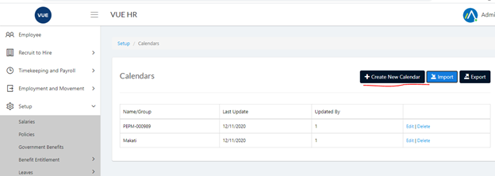
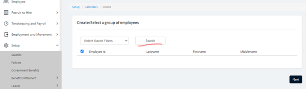
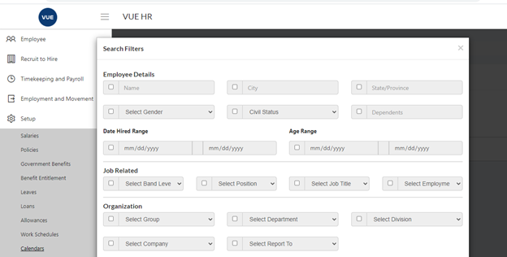
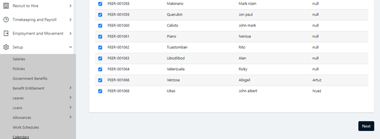
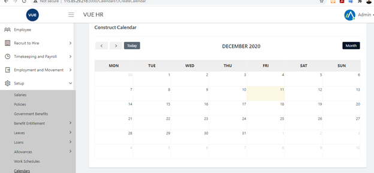
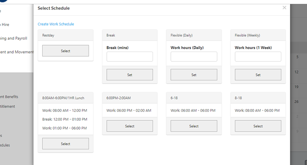

* Navigate to Setup > Calendars
* Click Create New Calendar

* Set correct filter

* Click Next

* Click the calendar cell and select the correct shift. 

* You can also setup restday and break mins here

* Click submit.
* You can go back and edit the calendar once created.

