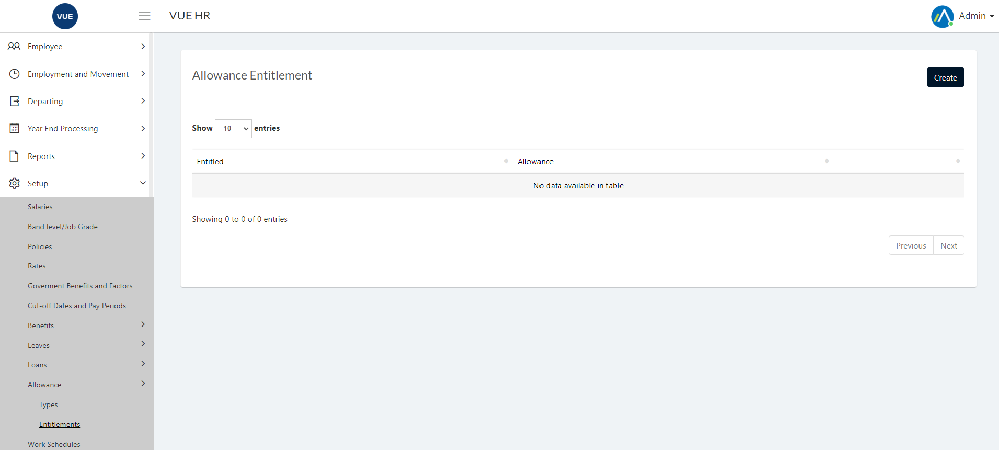
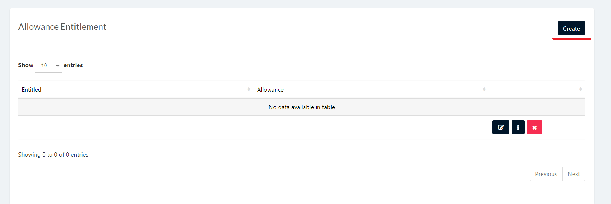
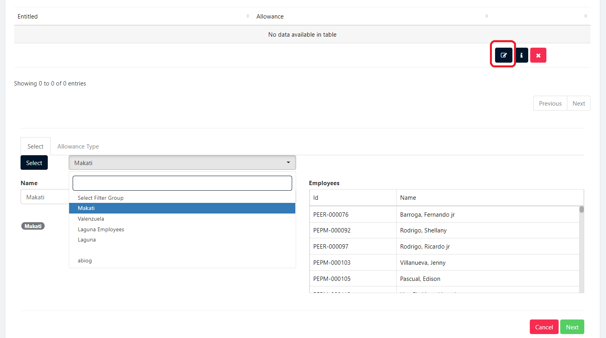
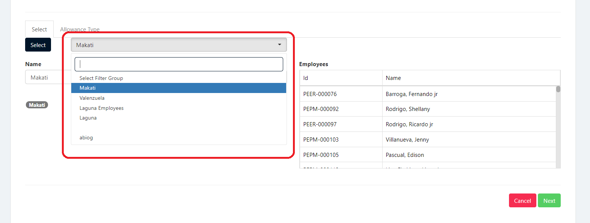
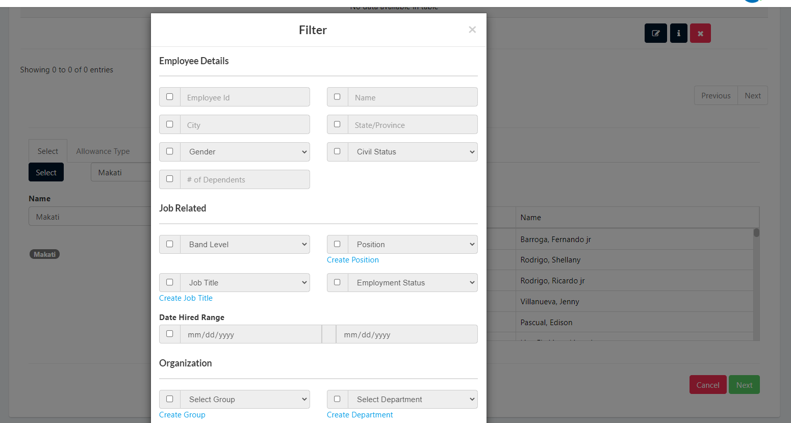
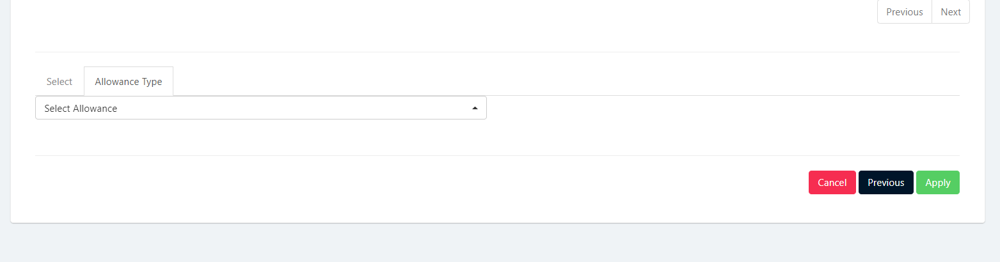

## Display List of Allowance Entitlement
1. Login to Vue using Admin or HR account. 

2. Go to Setup > Allowance > Entitlement

## Create Allowance Entitlement

1. Login to Vue using Admin or HR account. 

2. Go to Setup > Allowance > Entitlement

3. Click `Create` button to add a new row in table.

4. Click the `Edit` icon to open the filter group.

5. Select the filter group from the `Filter Group` dropdown 

> **Note** You also click the `Select` button to open the Employee Filter.

6. Click the `next` button to open the Allowance entitlement tab. Select the allowance entitlement for the dropdown and click `apply` button to save the loan entitlement

