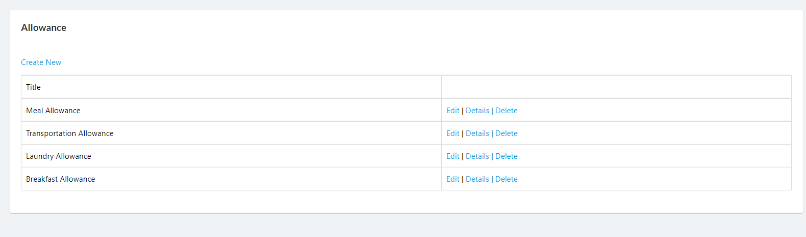
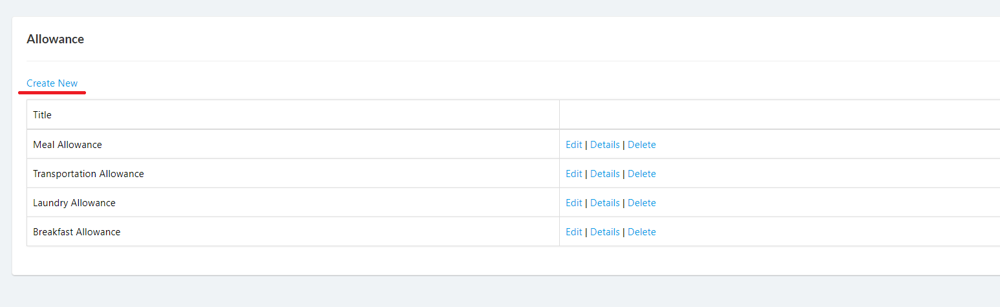
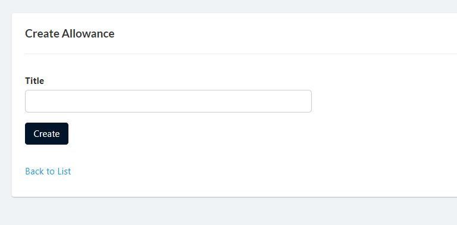
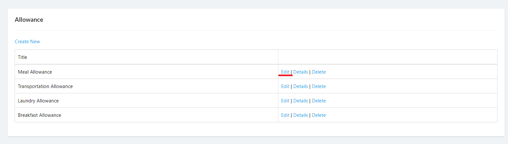
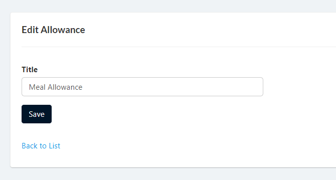

## Display List of Allowance Types
1. Login to Vue using Admin or HR account. 

2. Go to Setup > Allowance > Types

## Create Allowance Types

1. Login to Vue using Admin or HR account. 

2. Go to Setup > Allowance > Types

3. Click `Create New` button to open create page.

4. Input needed details and click `Create` button.

## Edit Allowance Types

1. Login to Vue using Admin or HR account. 

2. Go to Setup > Allowance > Types

3. Click `Edit` link to open the edit page.

4. Edit needed details and click `Save` button.

