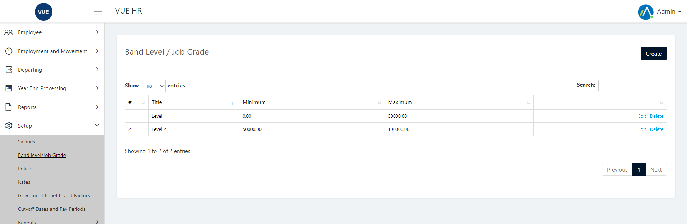
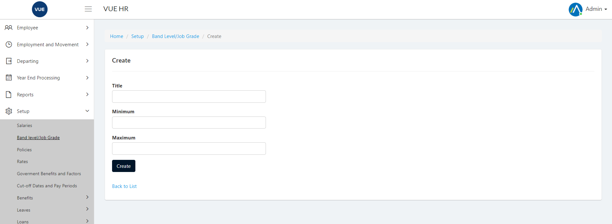
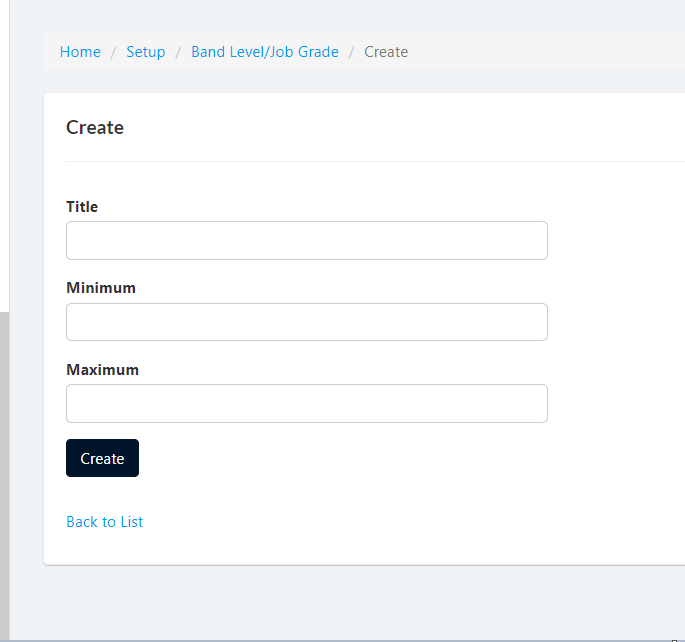
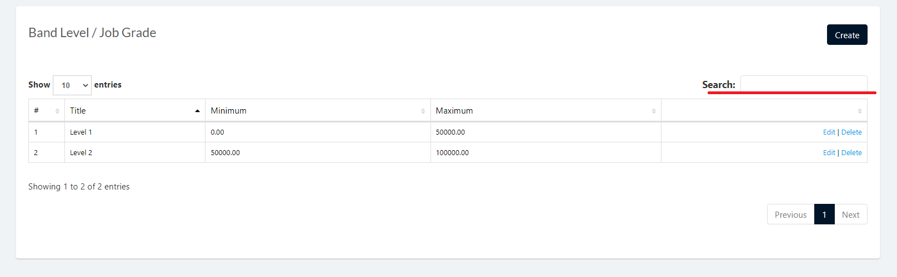
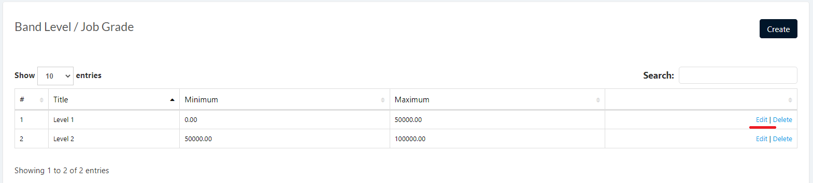
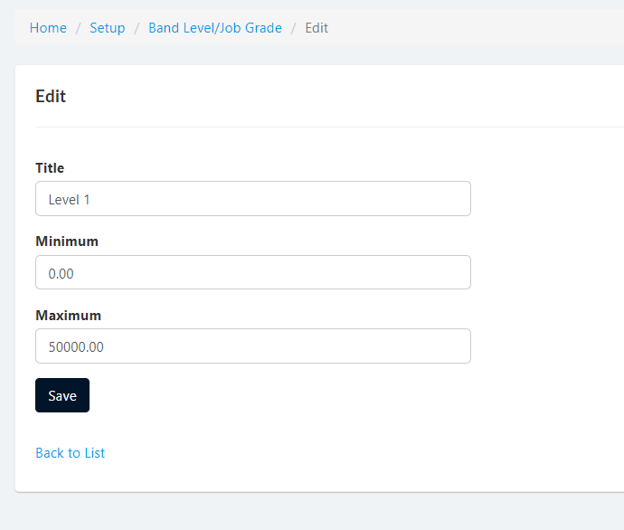
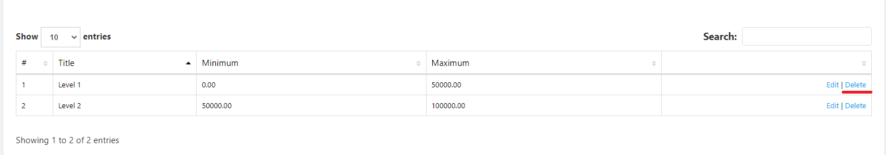
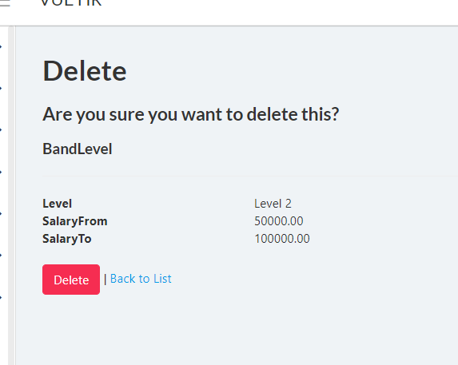

The Band Level page is used to create a band level to identify what level within the classification system assigned to an employee and his job position.

## Display List of Band Levels
1. Login to Vue using Admin or HR account. 

2. Go to Setup > Band Level/Job Grade

## Create Band Level

1. Login to Vue using Admin or HR account. 

2. Go to Setup > Band Level/Job Grade

3. Click `Create` button to open create page.

4. Input needed details and click `Create` button.

## Edit Band Level

1. Login to Vue using Admin or HR account. 

2. Go to Setup > Band Level/Job Grade

3. Input correct filters and click the `Search` button.

4. Click `Edit` link to open the edit page.

5. Input needed details and click `Save` button.

## Delete Band Level

1. Login to Vue using Admin or HR account. 

2. Go to Setup > Band Level/Job Grade

3. Input correct filters and click the `Search` button.

4. Click `Delete` link to open the delete confirmation page.

5. Click `delete` button to confrim delete.

