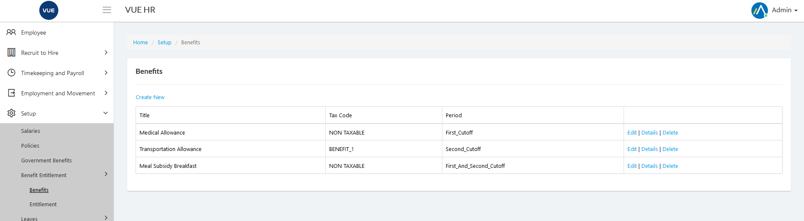
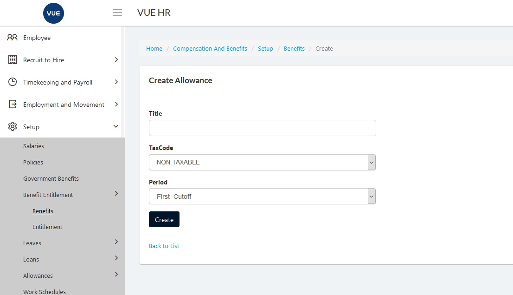
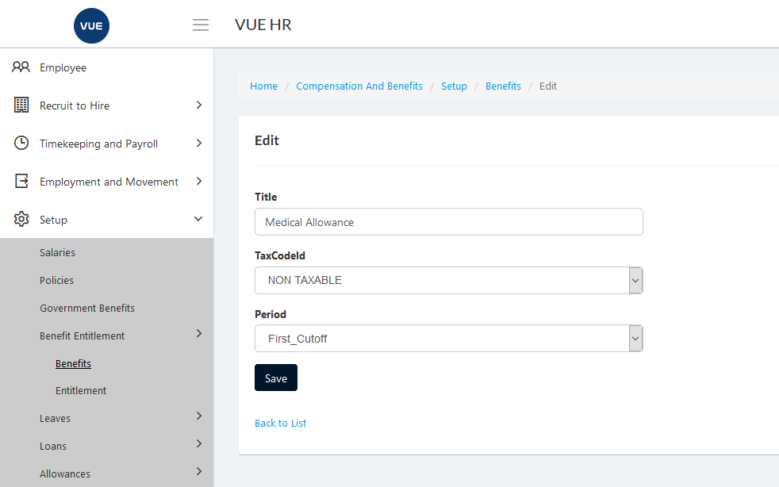
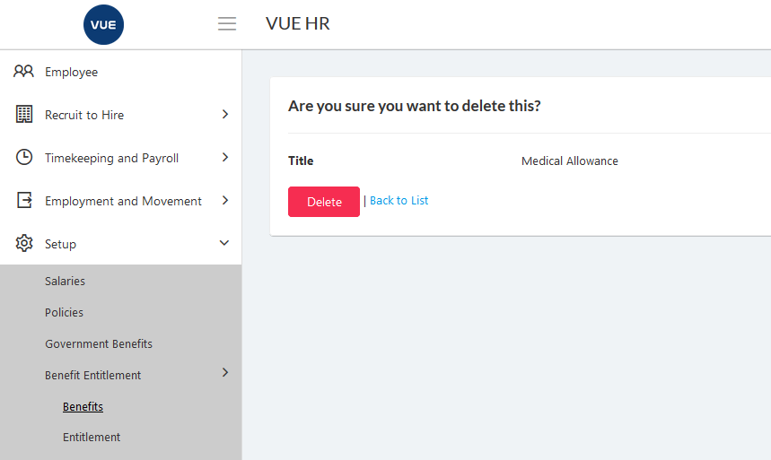

Benefit Setup is for creating different types of beenfits that employees are entitled to have.

These are the following steps for creating, updating and deleting the benefits.

## Creating New Benefit

1. Login to Vue using  Admin/HR account.
 
 

2. Go to Setup > Benefits Entitlement > Benefits.
3. Click `Create New` button.

  

4. Set the _Title_, _Tax Code_ and _Period_ and then click `Create` button.

> **Note** Click `Back to list` button to cancel create benefit.

  

## Edit/Update Benefit

1. Login to Vue using  Admin/HR account.
 
 

2. Go to Setup > Benefits Entitlement > Benefits.

3. Click `Edit` button.

   

4. Set the _Title_, _Tax Code_ and _Period_ and then click `Save` button.

> **Note** Click `Back to list` button to cancel create benefit.

  

## Delete Benefit

1. Login to Vue using Admin or HR account. 

2. Go to Setup > Benefits Entitlement > Benefits.

3. Click `Delete` button.

 

4. Click `Delete` button to confirm delete.

> **Note** Click `Back to list` button to cancel delete Locations.

 

