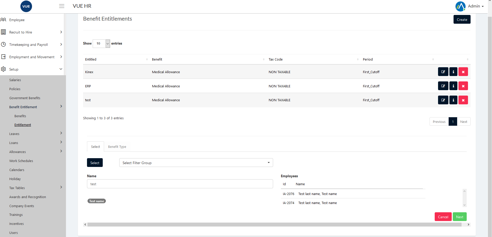
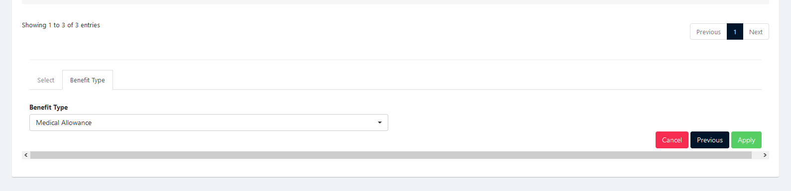

Benefit Entitlement is setting up created benefits for employees

These are the following steps for creating, updating and deleting the Benefit Entitlement.

## Creating New Benefit

1. Login to Vue using  Admin/HR account.
 
 

2. Go to Setup > Benefits Entitlement > Entitlement.
3. Click `Create` button.

  

4. A new row will be added to the list click `Edit`icon button.
  

5. Select the correct filter and then click `Next` button.

6. Select Benefit type and then click `Apply` button.

> **Note** Click `Cancel` button to cancel create benefit. Click `Previous` to return to employee filter select.

  

## Edit/Update Benefit

1. Login to Vue using  Admin/HR account.
 
 

2. Go to Setup > Benefits Entitlement > Entitlement.

  

3. Click `Edit` icon button.
  

4. Select the correct filter and then click `Next` button.

5. Select Benefit type and then click `Apply` button.

> **Note** Click `Cancel` button to cancel create benefit. Click `Previous` to return to employee filter select.

  

## Delete Benefit

1. Login to Vue using Admin or HR account. 

2. Go to Setup > Benefits Entitlement > Entitlement.

3. Click red `Delete` icon button.

 

 