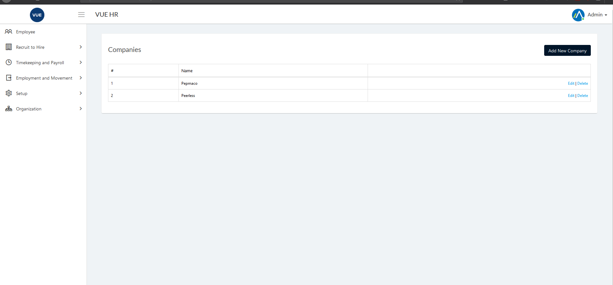

## Creating New Company

1. Login to Vue using  Admin/HR account.
 
 

2. Go to Organization > Company.
3. Click `Add New Company` button.

  

4. Set the following:
    * _Company Name_
    * _Email_
    * _Operating Hours_
    * _Address_

  

5. Click `Create` button.
> **Note** Click `Back to list` button to cancel company create.

## Edit/Update Company

1. Login to Vue using  Admin/HR account.
 
 

2. Go to Organization > Company.
3. Click `Edit` button.

  

4. Edit the following: 
    * _Company Name_
    * _Email_
    * _Operating Hours_
    * _Address_

5. Click `Save` button.

> **Note** Click `Back to list` button to cancel edit company.

  

## Delete Company

1. Login to Vue using  Admin/HR account.
 
 

2. Go to Organization > Company.
3. Click `Delete` button.

  

4. Click `Delete` button to confirm delete.

> **Note** Click `Back to list` button to cancel delete company.

  