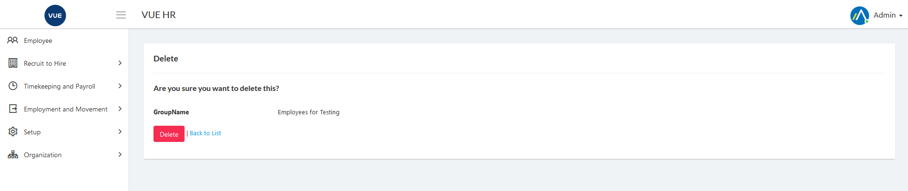

This page is for creating, updating and deleting Custom Groups.

## Create New Custom Group 

1. Login to Vue using Admin or HR account. 

2. Go to Organization > Custom Groups.

3. Click `Add New Group` button.

 

4. Set the search filter then click search.

 

5. Check all employee to be added in group and click `Next` button.

 

6. Set the _Group Name_ and Click `Submit` button.
> **Note** Click `Back to list` button to cancel create Custom Groups.

 

## Delete Custom Group 

1. Login to Vue using Admin or HR account. 

2. Go to Organization > Custom Groups.

3. Click `Delete` button.

 

4. Click `Delete` button to confirm delete.

> **Note** Click `Back to list` button to cancel delete Custom Groups.

 