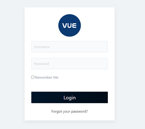
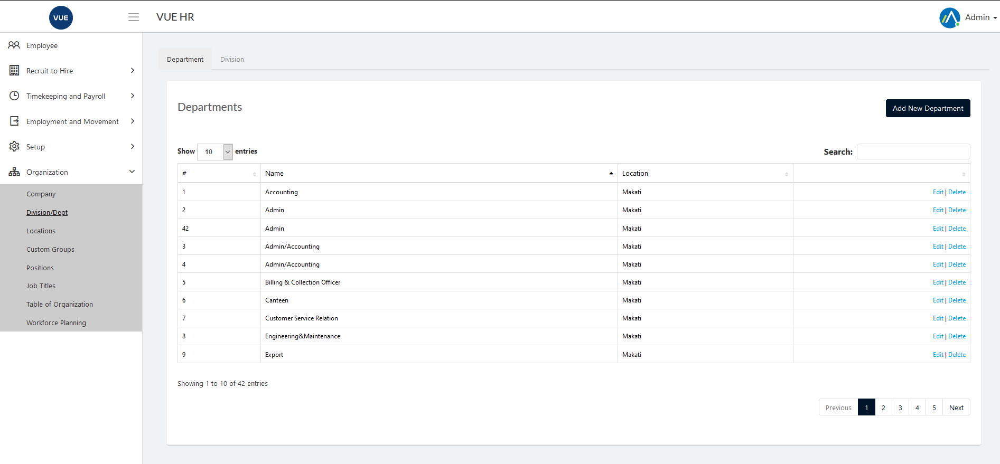
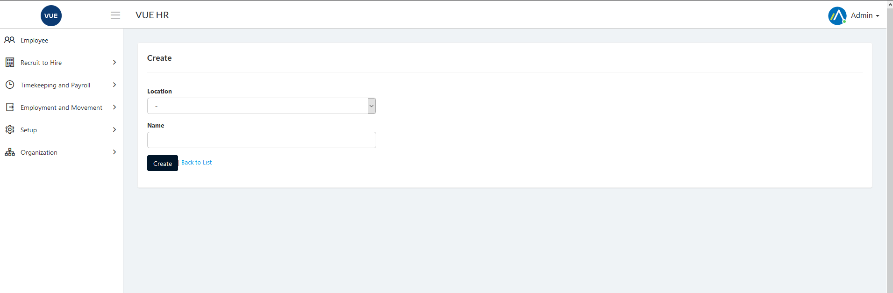
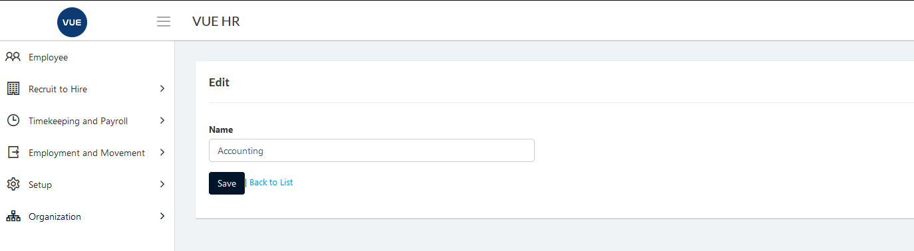
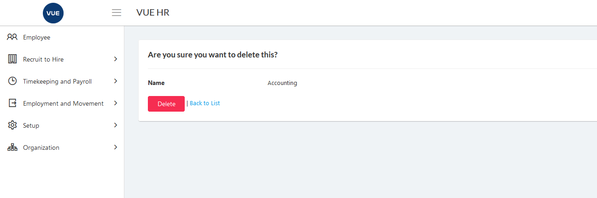

## Create New Department 

1. Login to Vue using Admin or HR account. 

2. Go to Organization > Division/Dept.

3. Click `Add New Department` button.

  

4. Set the _Location_ and _Department Name_.

5. Click `Create` button.
> **Note** Click `Back to list` button to cancel create department.

  

## Edit/Update Department

1. Login to Vue using Admin or HR account. 

2. Go to Organization > Division/Dept.

3. Click `Edit` button.

  

4. Set the _Department Name_ and click `Save` buttton.
> **Note** Click `Back to list` button to cancel update department.

  

## Delete Department

1. Login to Vue using Admin or HR account. 

2. Go to Organization > Division/Dept.

3. Click `Delete` button.

 

4. Click `Delete` button to confirm delete.

> **Note** Click `Back to list` button to cancel delete department.

 