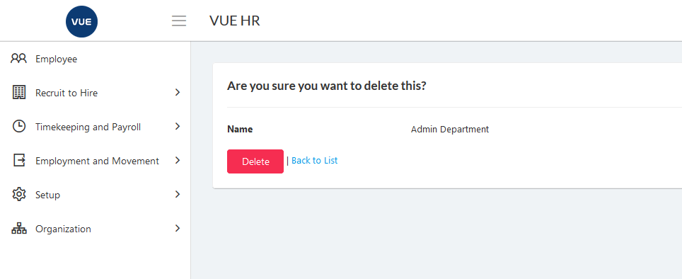

## Create New Department 

1. Login to Vue using Admin or HR account. 

2. Go to Organization > Division/Dept.

3. Click `Division` tab.

4. Click `Add New Division` button.

 

5. Set the _Location_ and _Division Name_.

6. Click `Create` button.
> **Note** Click `Back to list` button to cancel company division.

 

## Edit/Update Division

1. Login to Vue using Admin or HR account. 

2. Go to Organization > Division/Dept.

3. Click `Division` tab.

4. Click `Edit` button.

 

5. Set the _Division Name_ and click `Save` buttton.
> **Note** Click `Back to list` button to cancel update division.

 

## Delete Division

1. Login to Vue using Admin or HR account. 

2. Go to Organization > Division/Dept.

3. Click `Division` tab.

4. Click `Delete` button.

5. Click `Delete` button to confirm delete.
> **Note** Click `Back to list` button to cancel delete division.

 