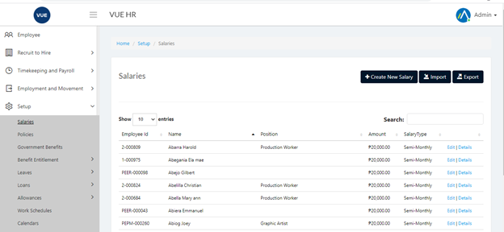
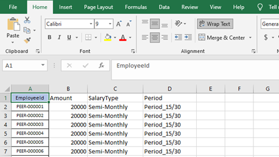
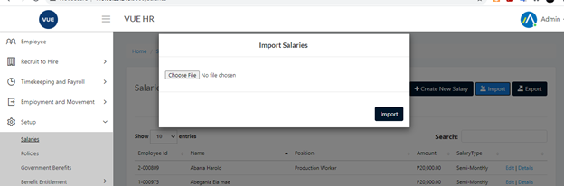

Salary entry is generated automatically with 0 amount when a new employee is added.
To update an employee's salary or multiple salsaries, Admin/HR users can either import salaries using the template or manually edit their salary in the salary page.

## Import Salaries 

* Update and Edit the Salary template.

> **Note**: Periods available: Period_15/30, Weekly_Monday, Weekly_Tuesday, Weekly_Thursday, Weekly_Friday, Weekly_Saturday, Weekly_Sunday

> **Note**: SalaryType is how the payroll for the employee is calculated.

> **Note**: SalaryTypes are : Semi-Monthly, Monthly, Daily

* Navigate to the _Policies_ page by selecting `Setup` > `Salaries` in the Nav Bar.

* Click the `Choose File` button then navigate and select the Salaries Template file.
* Click the `Import` button in the _Import Salaries_ modal.

<!-- **Bold** _italic_ `code` [Links](#url)

> Donec sit amet nisl. Aliquam semper ipsum sit amet velit. Suspendisse
> id sem consectetuer libero luctus adipiscing.

* Hey
* Ho
* Let's Go -->