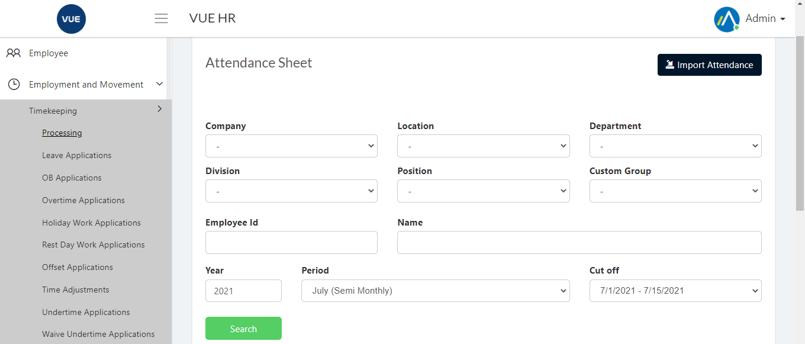
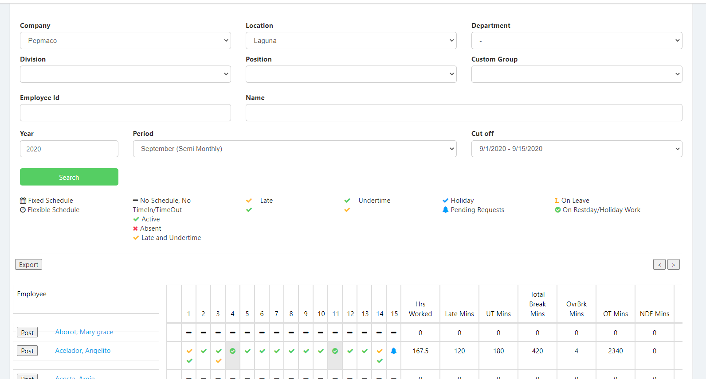
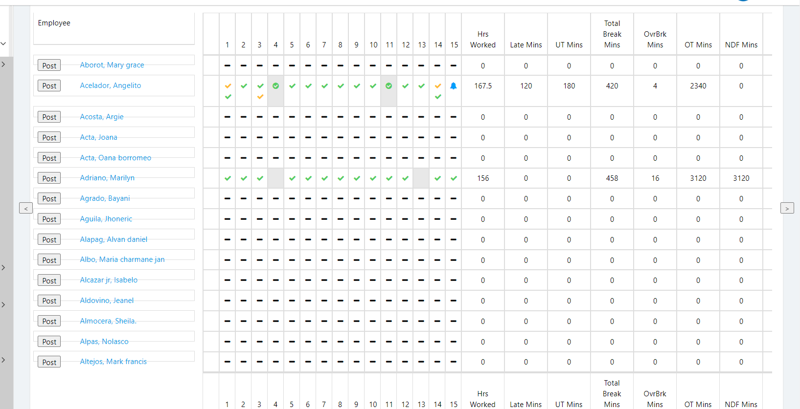

## Display Timekeeping

1. Login to Vue using Admin or HR account. 

* Go to Employment and Movement > Timekeeping > Processing

* Select Correct filter then search

## Posting Payroll

1. Login to Vue using Admin or HR account. 

2. Go to Employment and Movement > Timekeeping > Processing
 

3. Set the search filter then click search.

4. Click `post all` button or `post` button for selected employee

5. DTR will be posted in payroll page.