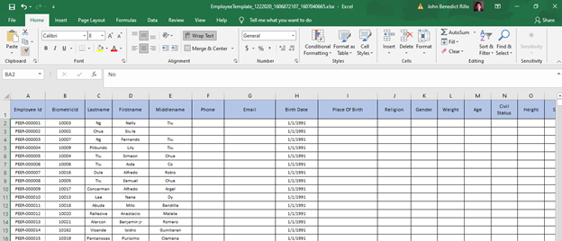

In importing employees through existing excel file, these are the following steps you should follow.

## Add/Update employees by import 

1. Add/Update employee profile using template.

2. Login to VUE using your Admin or HR account.

<!-- > **Note**: Click [here](/docs/users) to setup users. -->

3. Go to _Employee_ Page.
4. Click `Import` button then `Choose file`.

5. Select the Employee Template then click `Import`.

6. You will see a success message after the import.

<!-- ## Adding Employees BY Adding In the System Manually

* sample 1
* sample 2
* sample 3 -->

