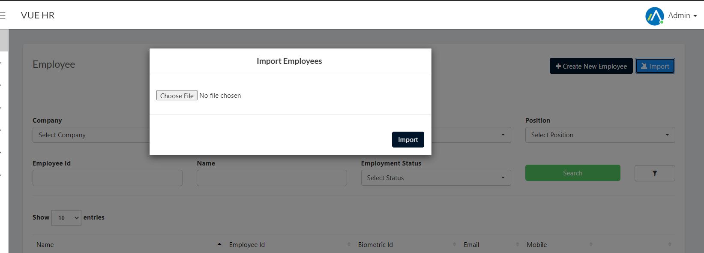

## List of Policies

* Required Hours Per Week 
* Required Hours Per Day 
* Is Flexible 
* Meet Required Daily Hours (Flexible) – Will calculate undertime if did not meet the required hours daily.
* Start Computing Late After (Flexible) – Will calculate late on flexible schedule
* Late Grace Period (Mins) 
* Start Late Count After Grace Period 
* Round Off Lates – 1 – 15 = 30mins late, 16mins and up = 60 mins late
* No Lates or Undertime 
* Paid Break – Will not deduct X mins of break in total work hours
* Follow Break Schedule – Will calculate overbreak if the break log is not within the break schedule.
* No Absent
* Half day if Tardiness Reached (Mins) 
* Absent if Tardiness Reached (Mins)
* Overtime Without Request – Automatic application of overtime
* Allow Post Shift Overtime
* Allow Pre-Shift Overtime
* Minimum Overtime Allowed 
* Allow Overtime when Required Hours in Week Reached – Has to reach required hours before calculating overtime
* Allow Overtime when Required Work in Month Reached – Has to reach required hours before calculating overtime

## Employee Policy Setup

### Employee Policy Setup using Template

* Open Employee template file we have provided.
* Add or Update Employee data.

> **Note**: _The Policies in the template has an Orange Header Color_.

* Login to Vue as an Admin or HR. 
> **Note**: Click [here](/docs/users) to setup users.

* Navigate to the _Employee_ Page by selecting `Employee` in the Nav Bar.
* Select the `Import` button to open up the _Import Employees_ modal.

* Click the `Choose File` button then navigate and select the Employee Template file.
* Click the `Import` button in the _Import Employees_ modal.

### Employee Policy Setup Manually

* Login to Vue as an Admin or HR. 
> Click [here](/docs/users) to setup users.

* Navigate to the _Policies_ page by selecting `Setup` > `Policies` in the Nav Bar.

* In the _Policies_ page set the filter and click search.

* A list will show of all employees searched. Select `Edit` on the employee to open employee policies.

* The _Employee Policies_ page display all policies that can be edited. 

* Click save to update the employee's policies.

