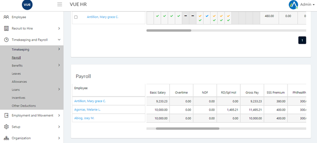
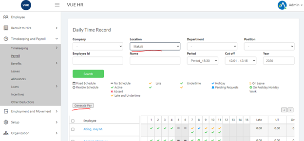

All Posted DTRs friom the timekeeping processing will appear in the Payroll page.

1. Login to Vue as an Admin or HR. 
<!-- > **Note**: Click [here](/docs/users) to setup users. -->

2. Go to `Timekeeping and Payroll ` > `Payroll `.

3. Set the search filter then click search.

4. Click `Generate Pay` button.

<!-- I can write content using [GitHub-flavored Markdown syntax](https://github.github.com/gfm/).

**Bold** _italic_ `code` [Links](#url)

> Donec sit amet nisl. Aliquam semper ipsum sit amet velit. Suspendisse
> id sem consectetuer libero luctus adipiscing.

* Hey
* Ho
* Let's Go -->