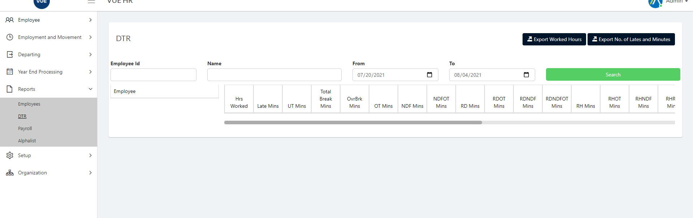
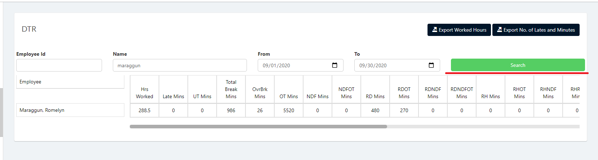
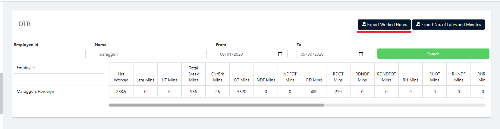

## Exporting Employee Worked Hours
1. Login to Vue using Admin or HR account. 

2. Go to Reports > DTR
 

3. Input correct filters and click the `Search` button.

4. Click Export `Export Worked Hours` button to export. The Exported file will be in .xlsx format.

## Exporting Employee Number of Lates and Minutes
1. Login to Vue using Admin or HR account. 

2. Go to Reports > DTR

3. Input correct filters and click the `Search` button.

4. Click Export `Export No. of Lates and Minutes` button to export. The Exported file will be in .xlsx format.