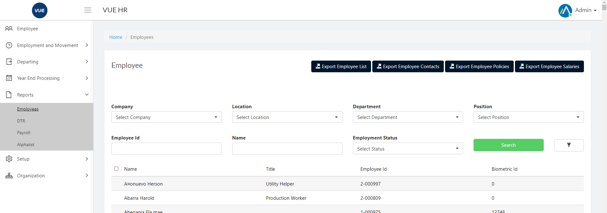

## Exporting Employee List
1. Login to Vue using Admin or HR account. 

2. Go to Reports > Employees
 

3. Input correct filters and click the `Search` button.

> **Note** The page will load all employees by default.

4. Click `Export Employee List` button to export. The Exported file will be in .xlsx format.

5. Sample Export file.

## Exporting Employee Contact
1. Login to Vue using Admin or HR account. 

2. Go to Reports > Employees
 

3. Input correct filters and click the `Search` button.

> **Note** The page will load all employees by default.

4. Click `Export Employee Contact` button to export. The Exported file will be in .xlsx format.

5. Sample Export file.

## Exporting Employee Policies
1. Login to Vue using Admin or HR account. 

2. Go to Reports > Employees
 

3. Input correct filters and click the `Search` button.

> **Note** The page will load all employees by default.

4. Click `Export Employee Policies` button to export. The Exported file will be in .xlsx format.

5. Sample Export file.

## Exporting Employee Salaries
1. Login to Vue using Admin or HR account. 

2. Go to Reports > Employees
 

3. Input correct filters and click the `Search` button.

> **Note** The page will load all employees by default.

4. Click `Export Employee Salaries` button to export. The Exported file will be in .xlsx format.

5. Sample Export file.
