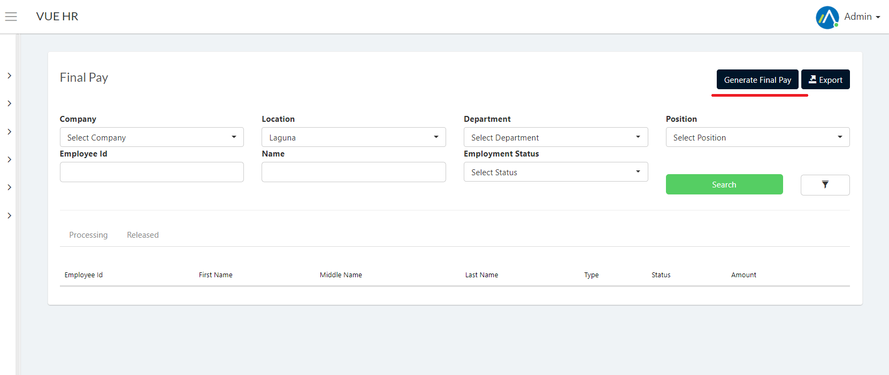

To Generate Pay, these are the steps to follow.

1. Login to Vue using Admin or HR account. 

2. Go to Departing > Final Pay 
 

3. Click `Generate Pay` button

4. Input all needed information and click `Calculate` button to submit final pay.

> **Note** Employee must have a generated pay in payroll. Also, the status must be resigned.

