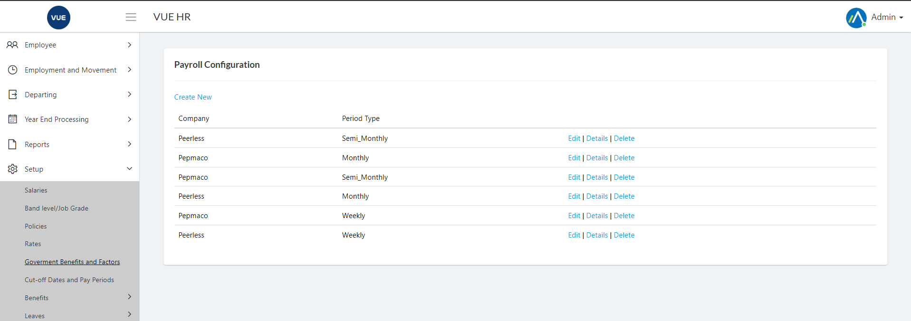
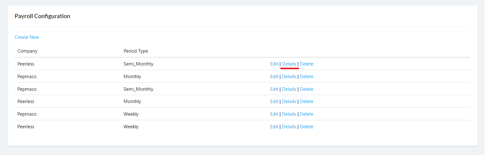
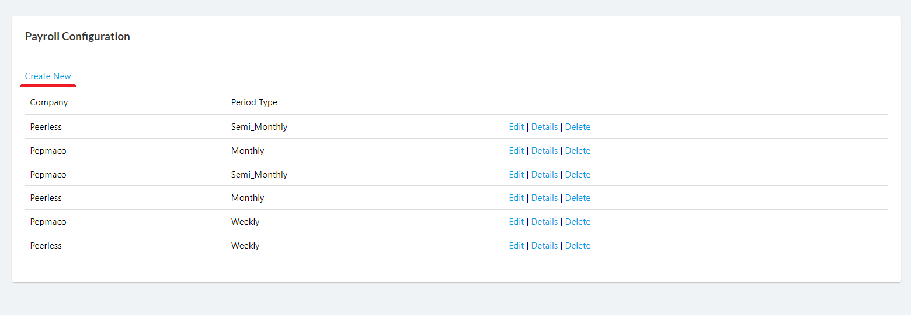
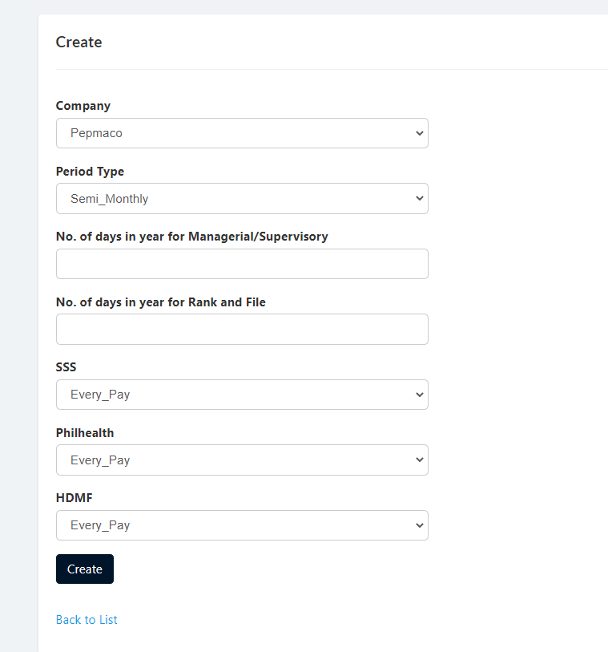
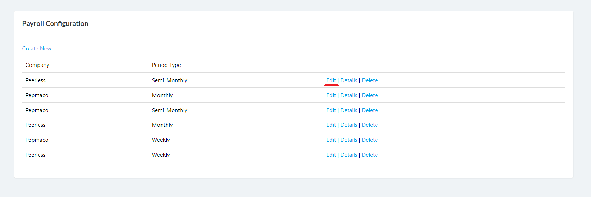
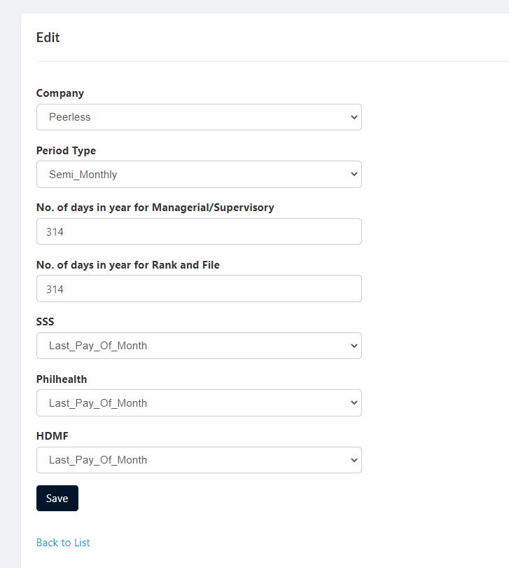
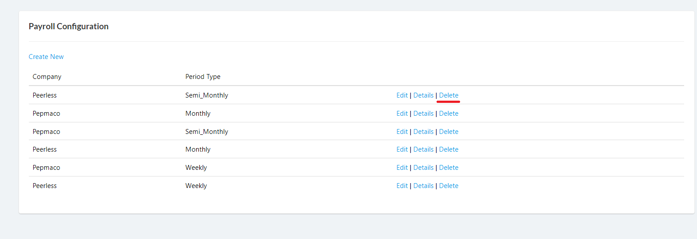
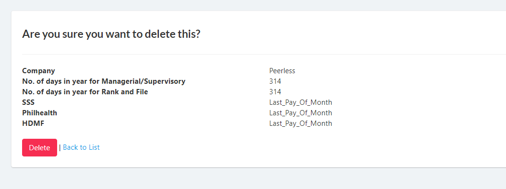

## Display List of Payroll Configurations
1. Login to Vue using Admin or HR account. 

2. Go to Setup > Government Benefits and Factors

3. Click `Details` to open details page.

## Create Payroll Configurations

1. Login to Vue using Admin or HR account. 

2. Go to Setup > Government Benefits and Factors

3. Click `Create New` button to open create page.

4. Input needed details and click `Create` button.

## Edit Payroll Configurations

1. Login to Vue using Admin or HR account. 

2. Go to Setup > Government Benefits and Factors

3. Click `Edit` to open edit page.

4. Input needed details and click `save` button.

## Delete Payroll Configurations

1. Login to Vue using Admin or HR account. 

2. Go to Setup > Government Benefits and FactorsGovernment Benefits and Factors

3. Click `Delete` link to open the delete confirmation page.

4. Click `delete` button to confrim delete.

