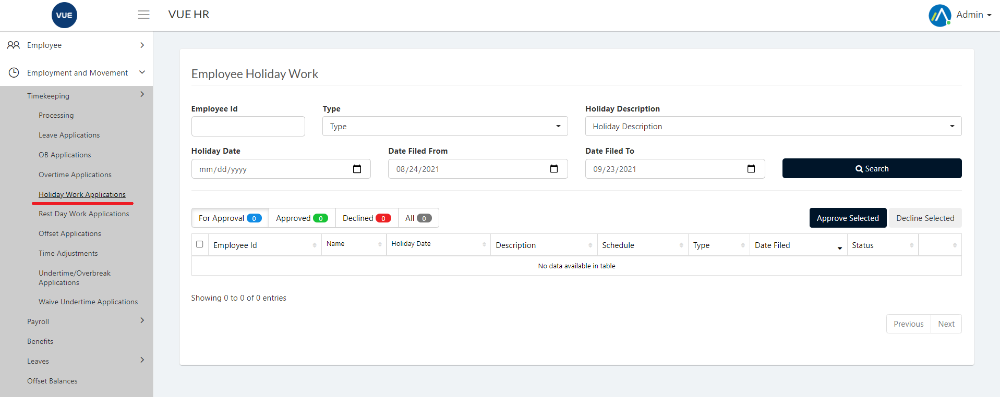
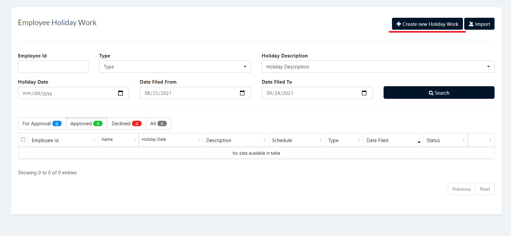
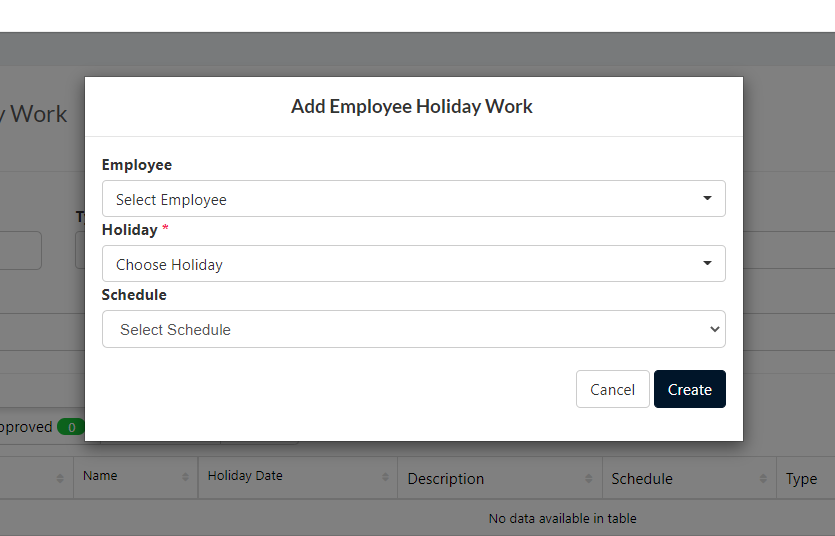
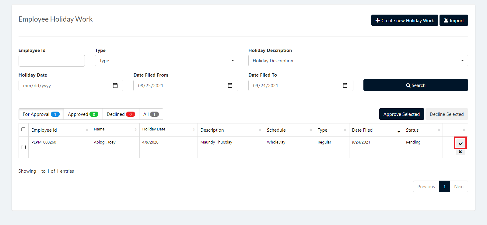
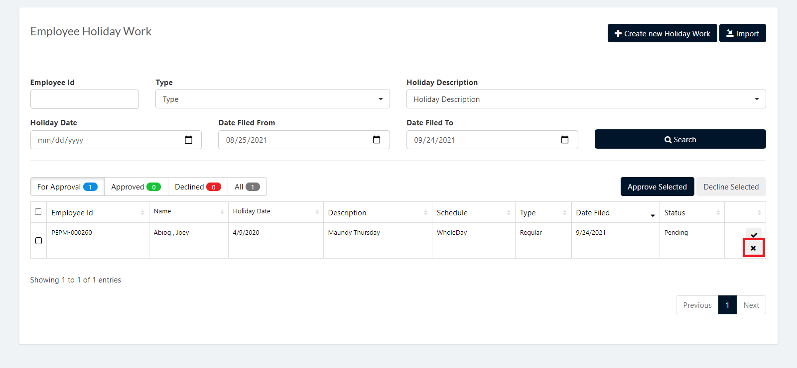

Holiday Work Request Application is used to apply for holiday work requests

These are the following steps for creating and deleting the Holiday Work Request.

## Create Holiday Work Request Applications 

1. Login to Vue using  Admin/HR account.
 
 

2. Go to Timekeeping and Payroll > Processing > Holiday Work Application.

  

3. Click `Create New Holiday Work` button.

  

5. Select an employee, Holiday, Schedule and then click `Create` button.

> **Note** Click `Cancel` button to cancel create Holiday Work Request.

  

## Approving Holiday Work Request Applications 

1. Login to Vue using Admin or HR account. 

2. Go to Timekeeping and Payroll > Processing > Holiday Work Application.

3. Set the Correct filter and click the search button

4. Click the `✓` button selected employee to approve.

> **Note** To approve multiple Holiday Work Applications check the employee and click `Approve Selected` button.

 

 ## Decline Holiday Work Request Applications 
 
 1. Login to Vue using Admin or HR account. 

2. Go to Timekeeping and Payroll > Processing > Holiday Work Application.

3. Set the Correct filter and click the search button

4. Click the `X` button selected employee to approve.

> **Note** To decline multiple Holiday Work Applications check the employee and click `Decline Selected` button.

 
