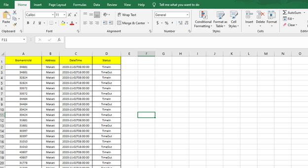
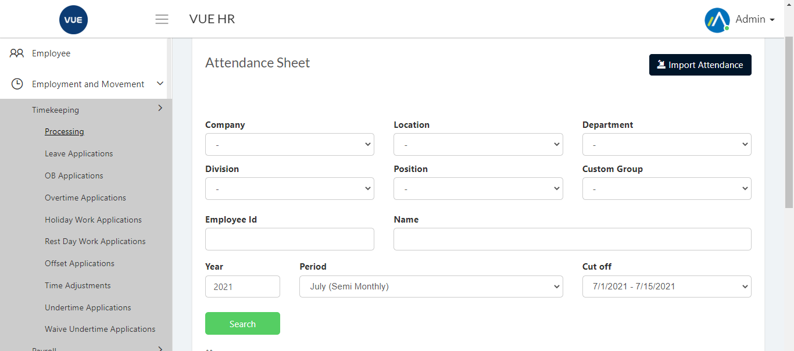
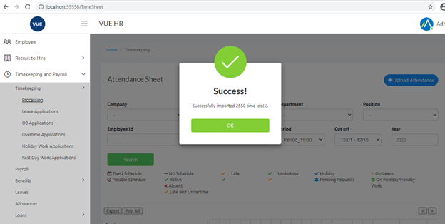

1. Add/Update attendance template.

2. Login to Vue using Admin or HR account. 

3. Go to Timekeeping and Payroll > Timekeeping > Processing
 

4. Click `Upload Attendance` button then `Choose file`.
5. Select the Attendance Template then click `Upload Attendance`.
6. Success message will appear when import is done without errors.

