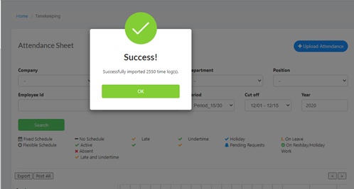

* Open attendance template file we have provided.

* Add or Update Employee data

* Navigate to Timekeeping and Payroll > Timekeeping > Processing
 

* Import the attendance template
* Success message will appear when import is done without errors.

