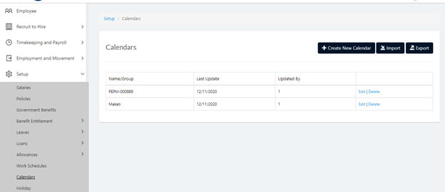
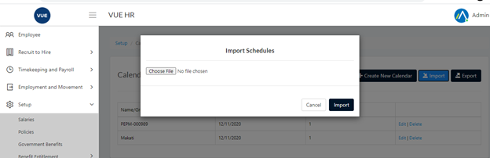

1. Add/Update Schedules Template template.

2. Login to Vue as Admin, HR, or MSS user.
 
 

3. Go to Setup > Calendars.

4. Click `Import` button then `Choose file`.

  
5.  Select the Schedules Template then click `Import`.

