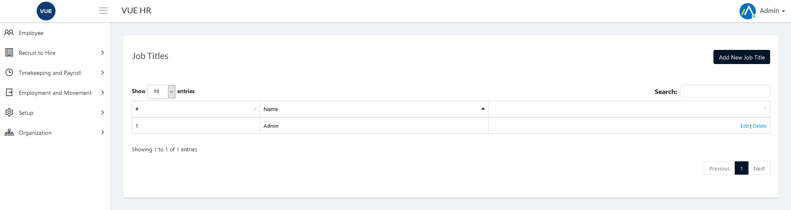
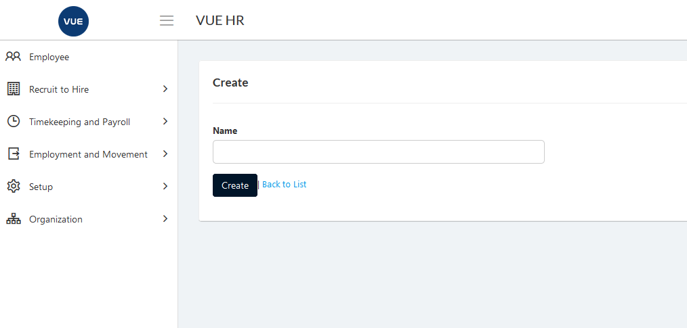
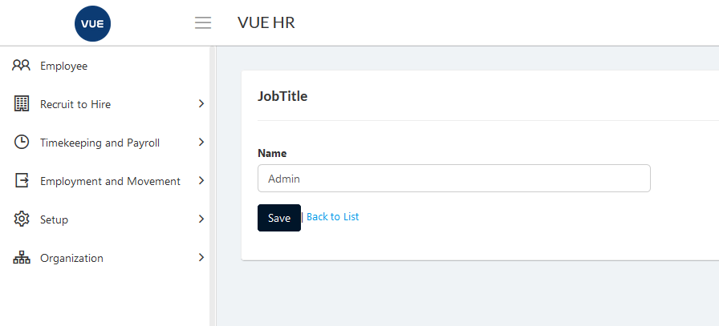
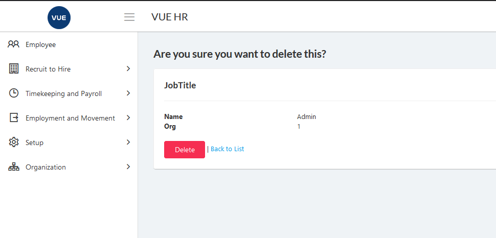

This page is for creating, updating and deleting Job Titles.

## Create New Job Title 

1. Login to Vue using Admin or HR account. 

2. Go to Organization > Job Titles.

3. Click `Add New Job Title` button.

  

4. Set the _Name_ and click `Create` button.
> **Note** Click `Back to list` button to cancel create Job Title.

  

## Edit/Update Job Title

1. Login to Vue using Admin or HR account. 

2. Go to Organization > Job Titles.

3. Click `Edit` button.

  

4. Set the _Name_ and click `Save` buttton.
> **Note** Click `Back to list` button to cancel update Job Title.

  

## Delete Job Title

1. Login to Vue using Admin or HR account. 

2. Go to Organization > Job Titles.

3. Click `Delete` button.

 

4. Click `Delete` button to confirm delete.

> **Note** Click `Back to list` button to cancel delete Job Title.

 