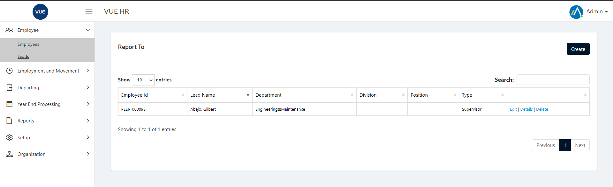
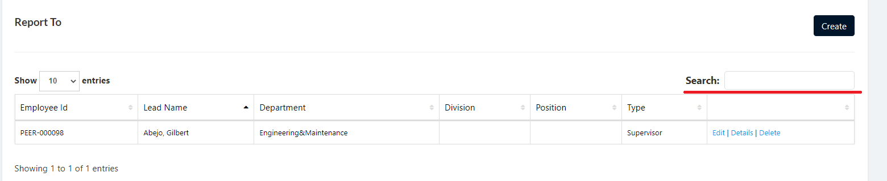
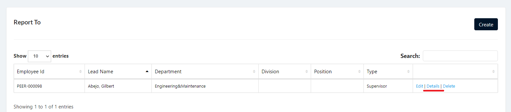
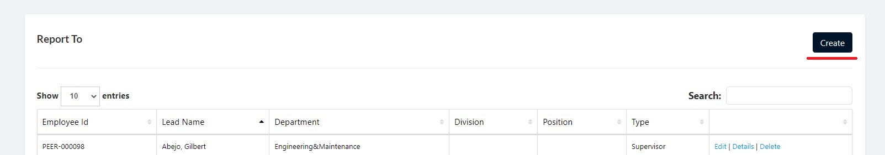
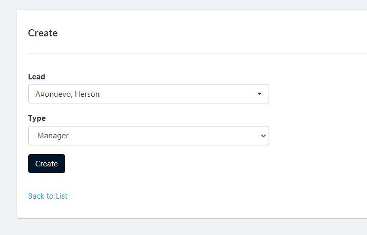
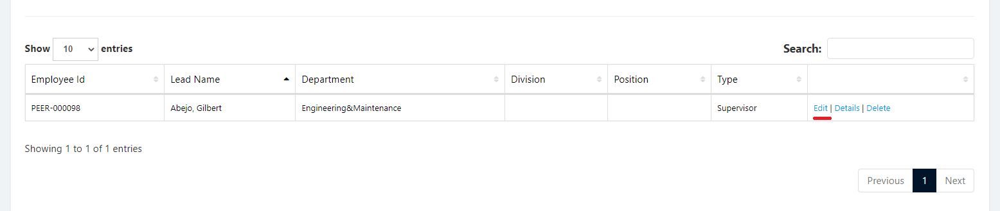
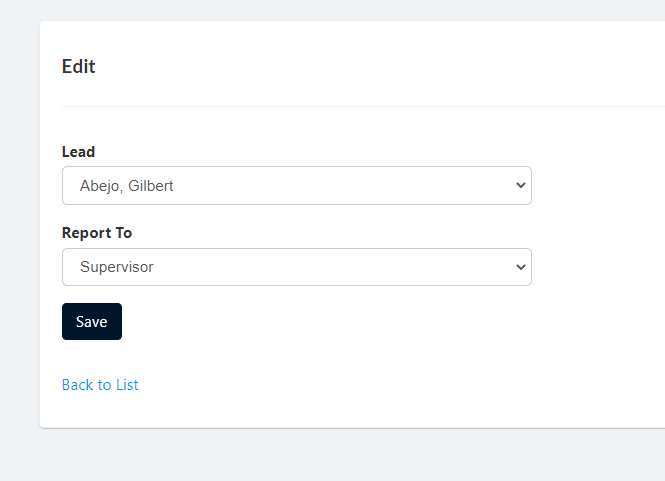
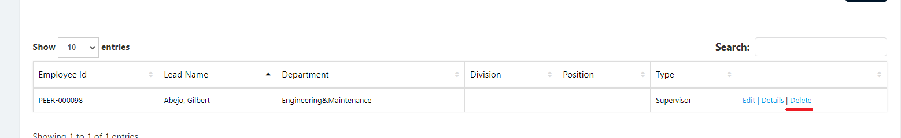

## Display Leads

Employee Leads is setup to create a list of employees as leads or who other employees report to, which can be setup when creating a new employee or editing an employee.

1. Login to Vue using Admin or HR account. 

2. Go to Employee > Leads

3. Select Correct filter then search

4. Click `Details` to open details page.

## Create Leads

1. Login to Vue using Admin or HR account. 

2. Go to Employee > Leads

3. Click `Create` button to open create page.

4. Input needed details and click `Create` button.

## Edit Leads

1. Login to Vue using Admin or HR account. 

2. Go to Employee > Leads

3. Select Correct filter then search.

4. Click `Edit` link to open edit page.

5. Input needed details and click `Save` button.

## Delete Leads

1. Login to Vue using Admin or HR account. 

2. Go to Employee > Leads

3. Select Correct filter then search.

4. Click `Delete` link to open delete confirmation page.

5. Click `Delete` to confirm delete.