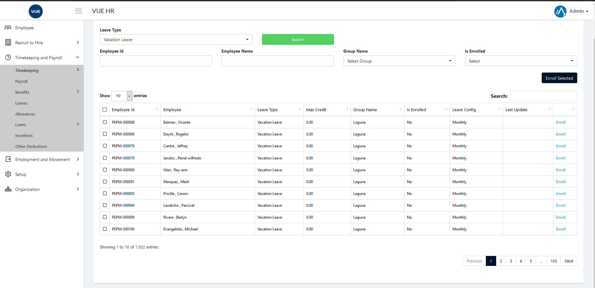
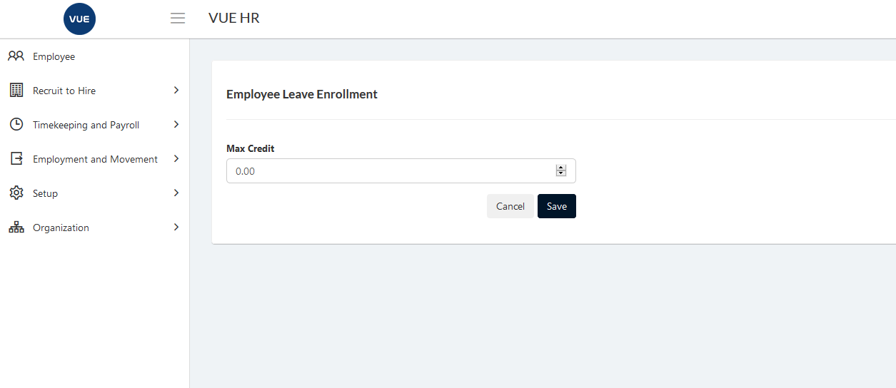

Leave Enrollment is used to enroll different types of leave for an employee.

These are the following steps for enrolling employees for leave

## Enroll Leaves for Employee

1. Login to Vue using  Admin/HR account.
 
 

2. Go to Employment and Movement > Leaves > Enrollment.
3. Set the search filter then click `Search` button.
   

4. For multiple employees check employees on the list and click `Enroll Selected` or click `enroll` for single employee

   
