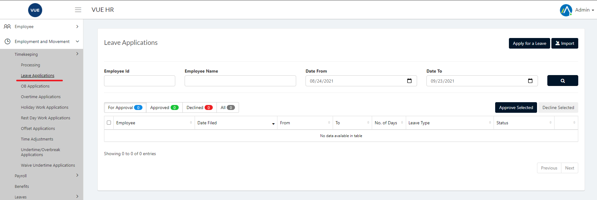
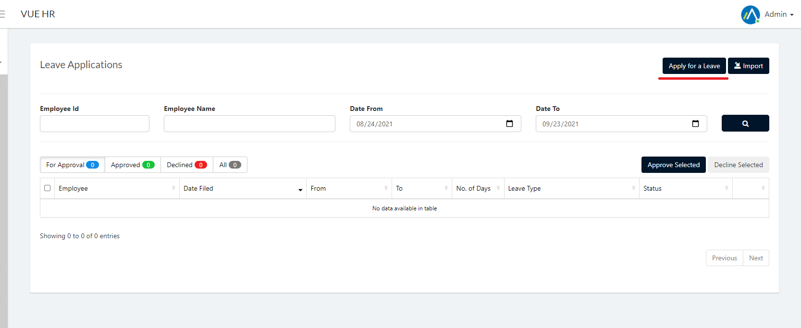
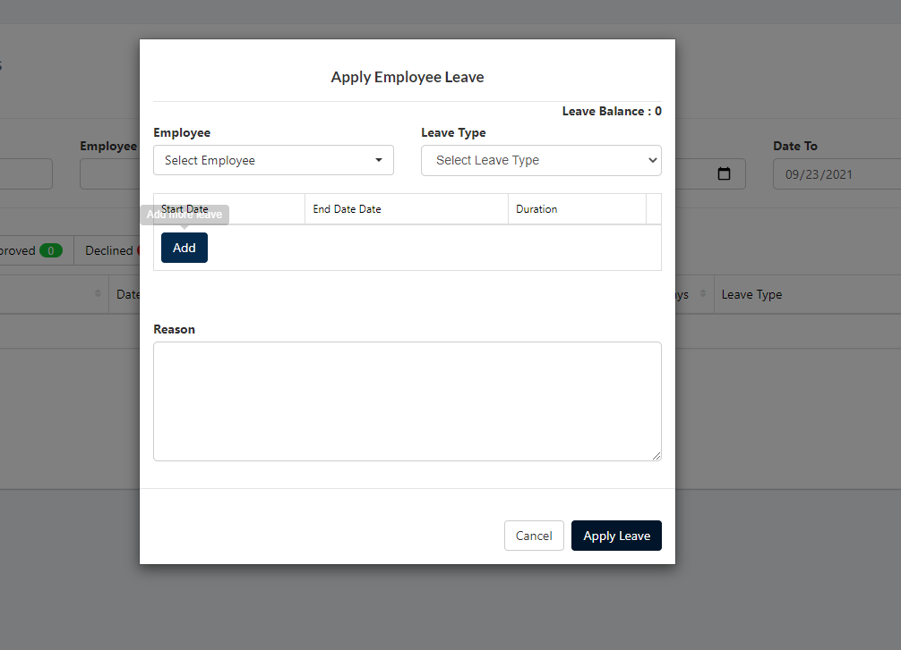
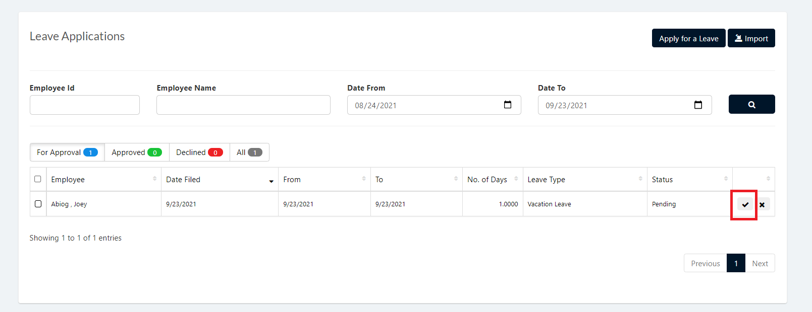
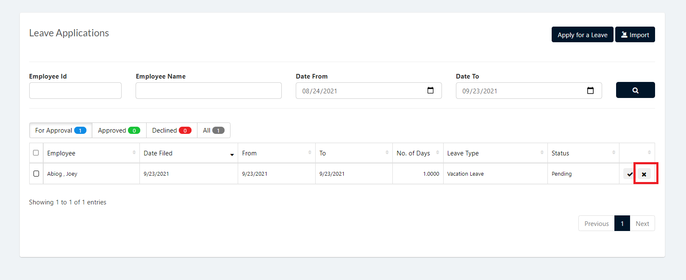

Leave Application is used to apply for leaves that are entitled to employees. Leave Credits is given in Leave entitlement.

These are the following steps for creating and deleting the Leave Applications.

## Create Leave Applications 

1. Login to Vue using  Admin/HR account.
 
 

2. Go to Employment and Movement > Timekeeping > Processing > Leave Application.

  

3. Click `Apply for Leave` button.

  

4. Select an employee, correct leave type and then click `Add` button.

5. Set Start date, End date, Duration and provide reason and click `Apply Leave` button.

> **Note** Click `Cancel` button to cancel create employee leave.

  

## Approving Leave Applications 

1. Login to Vue using Admin or HR account. 

2. Go to Employment and Movement > Timekeeping > Processing > Leave Application.

3. Set the Correct filter and click the search button

4. Click the `✓` button selected employee to approve.

 

 ## Decline Leave Applications 
 
 1. Login to Vue using Admin or HR account. 

2. Go to Employment and Movement > Timekeeping > Processing > Leave Application.

3. Set the Correct filter and click the search button

4. Click the `X` button selected employee to approve.

 
