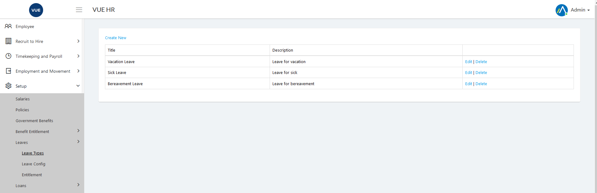
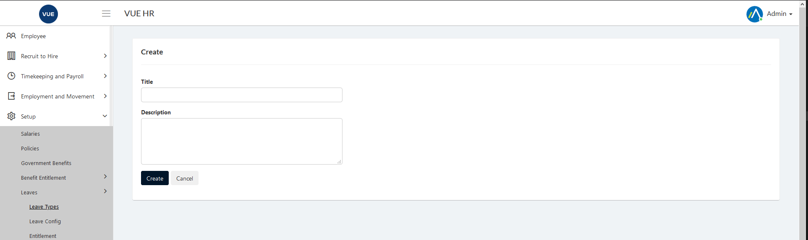
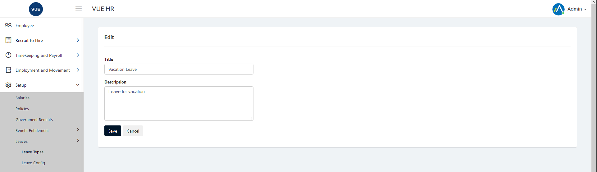
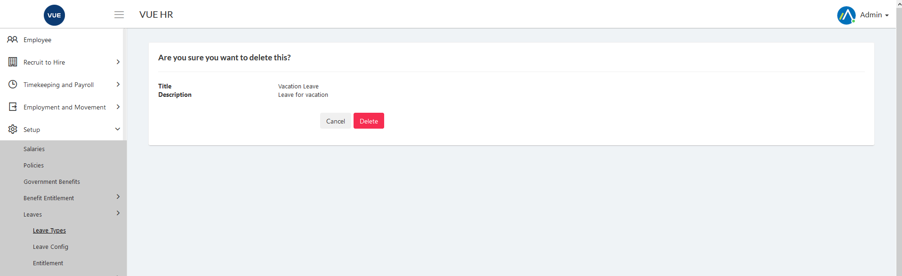

Leaves Config is to setup leaves entitled to employees.

These are the following steps for creating, updating and deleting the leave config.

## Creating New Leave Configuration

1. Login to Vue using  Admin/HR account.
 
 

2. Go to Setup > Leaves > Leave Config.
3. Click `Add New Configuration` button.

  

4. Set the following
    * _Title_
    * _Earning Date_
    * _Credit to Balance Date_
    * _Leave Type_
    * _Transfer Credit to Balance Schedule_
    * _Credit Earning Schedule_

5. Select _Factor_ from list and click `dd Factor` button.

6. Click `Create` button.

> **Note** Click `Back To List` button to cancel create leave config.

  

## Edit/Update Leave Configuration

1. Login to Vue using  Admin/HR account.
 
 

2. Go to Setup > Leaves > Leave Types.

3. Click `Edit` button.

  

4. Edit the following
    * _Title_
    * _Earning Date_
    * _Credit to Balance Date_
    * _Leave Type_
    * _Transfer Credit to Balance Schedule_
    * _Credit Earning Schedule_

5. Click `Save` button.

> **Note** Click `Back To List` button to cancel edit leave config.

  

## Delete Leave Configuration

1. Login to Vue using  Admin/HR account.
 
 

2. Go to Setup > Leaves > Leave Types.
3. Click `Delete` button.

  

4. Click `Delete` button to confirm delete.

> **Note** Click `Cancel` button to cancel delete leave config.

  

