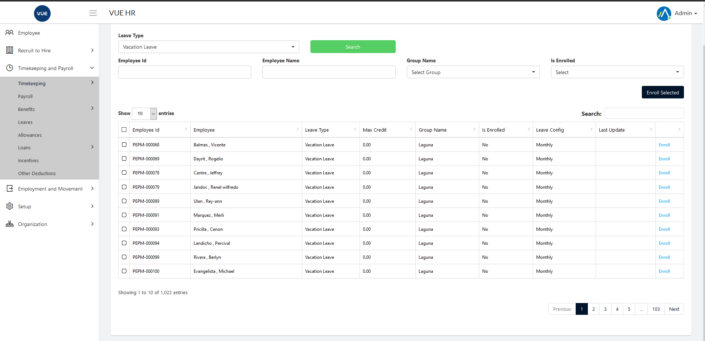

Leave Entitlement is used to set up created Leave for employees

These are the following steps for creating, updating and deleting the Leave Entitlement.

## Create Leave Entitlement 

<!-- 1. Login to Vue using  Admin/HR account.
 
 

2. Go to Timekeeping and Payroll > Leaves.
3. Set the search filter then click `Search` button.
   

4. For multiple employees check employees on the list and click `Enroll Selected` or click `enroll` for single employee

    -->
