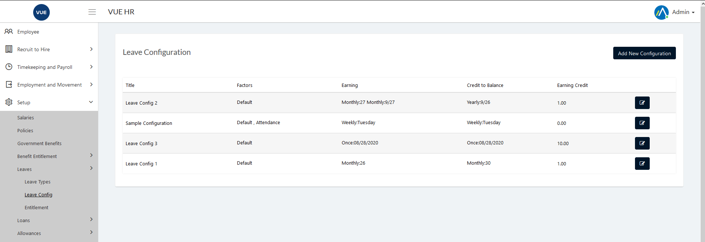
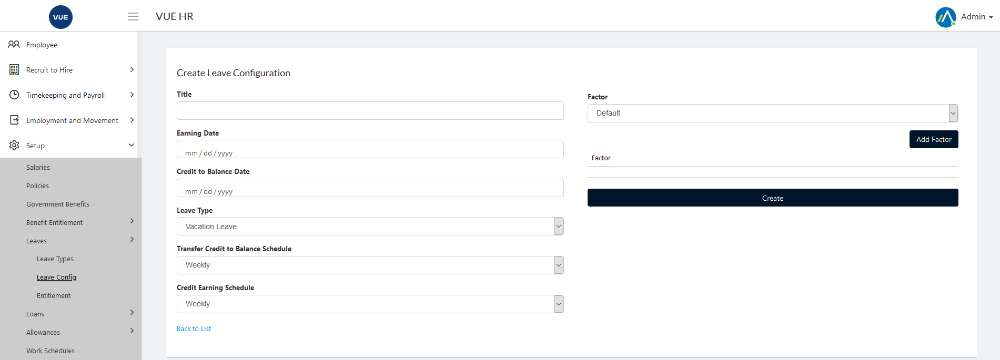
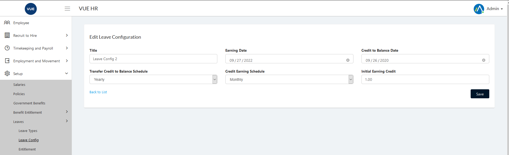

Leaves Setup is for creating different types of leaves that employees are entitled to have.

These are the following steps for creating, updating and deleting the leave types.

## Creating New Leave Types

1. Login to Vue using  Admin/HR account.
 
 

2. Go to Setup > Leaves > Leave Types.
3. Click `Create New` button.

  

4. Set the _Title_ and _Description_ and then click `Create` button.

> **Note** Click `Cancel` button to cancel create leave type.

  

## Edit/Update Leave Types

1. Login to Vue using  Admin/HR account.
 
 

2. Go to Setup > Leaves > Leave Types.

3. Click `Edit` button.

  

4. Edit the _Title_ and _Description_ and then click `Save` button.

> **Note** Click `Cancel` button to cancel edit leave type.

  

