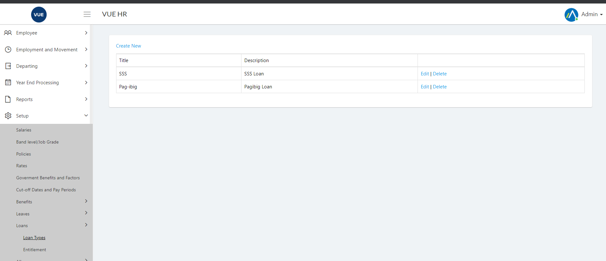
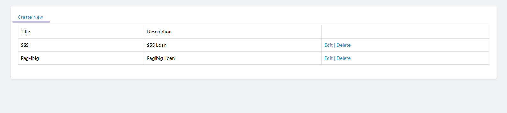
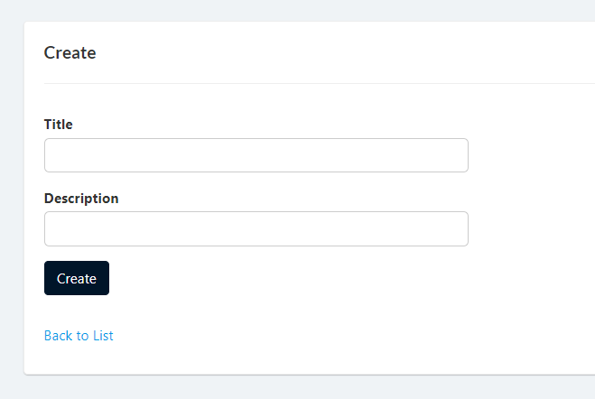
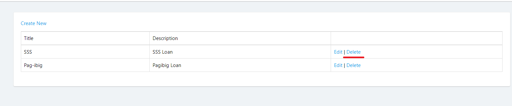
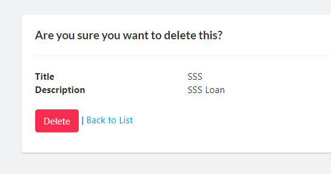

## Display List of Loan Types
1. Login to Vue using Admin or HR account. 

2. Go to Setup > Loans > Loan Types

## Create Loan Types

1. Login to Vue using Admin or HR account. 

2. Go to Setup > Loans > Loan Types

3. Click `Create New` button to open create page.

4. Input needed details and click `Create` button.

## Delete Loan Types

1. Login to Vue using Admin or HR account. 

2. Go to Setup > Loans > Loan Types

3. Click `Delete` link to open the delete confirmation page.

4. Click `delete` button to confrim delete.

