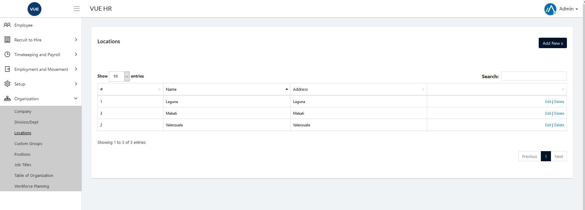
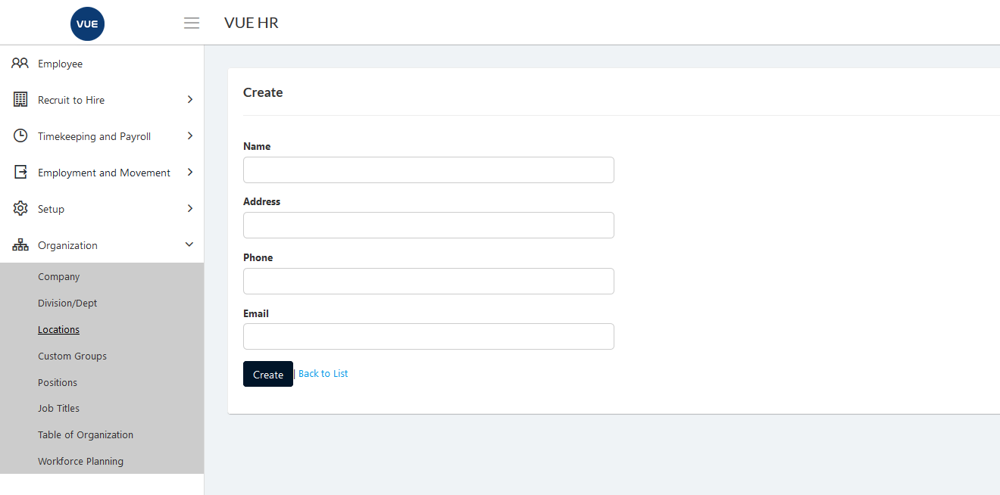

These are the following steps for creating, updating and deleting Location.

## Create New Location 

1. Login to Vue using Admin or HR account. 

2. Go to Organization > Locations.

3. Click `Add New Location` button.

  

4. Set the _Location Name_, _Address_, _Phone_, _Email_.

5. Click `Create` button.
> **Note** Click `Back to list` button to cancel create Locations.

  

## Edit/Update Location

1. Login to Vue using Admin or HR account. 

2. Go to Organization > Locations.

3. Click `Edit` button.

  

4. Set the _Location Name_, _Address_, _Phone_, _Email_ and click `Save` buttton.
> **Note** Click `Back to list` button to cancel update Locations.

  

## Delete Location

1. Login to Vue using Admin or HR account. 

2. Go to Organization > Locations.

3. Click `Delete` button.

 

4. Click `Delete` button to confirm delete.

> **Note** Click `Back to list` button to cancel delete Locations.

 