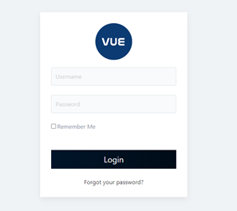
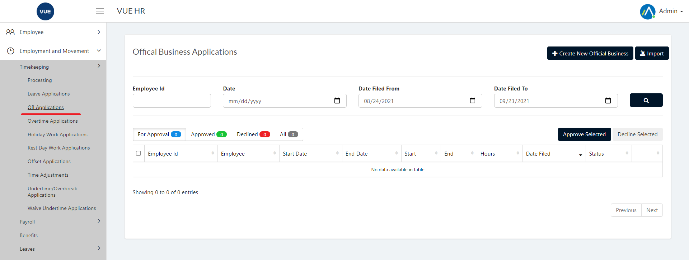
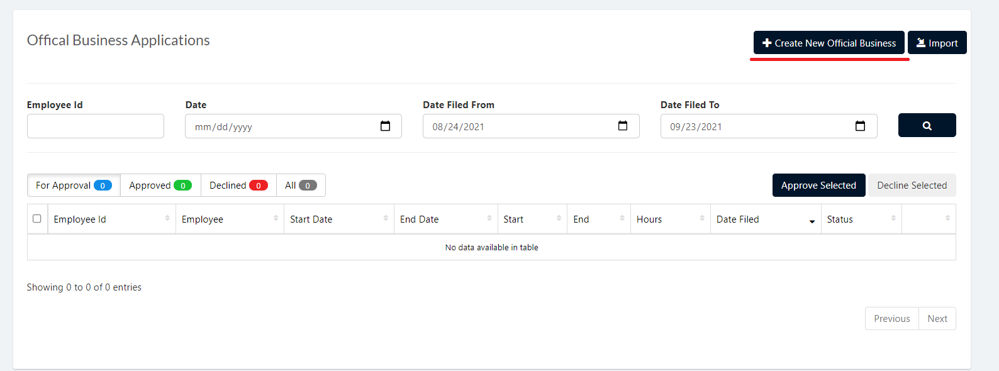
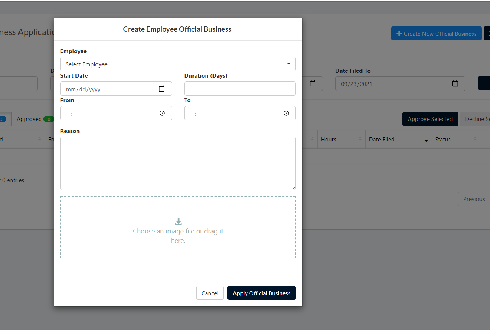
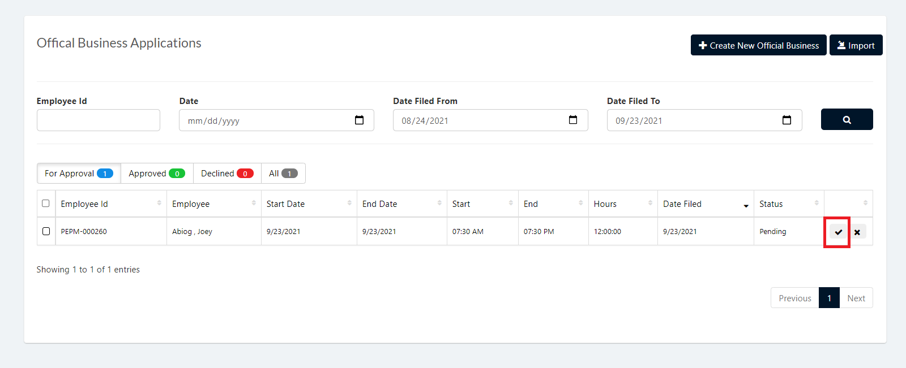
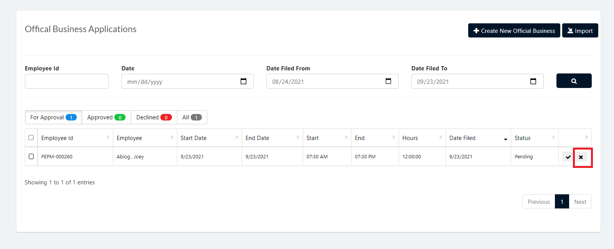

The Official Business page is for applying, approving and declining official business applications.

These are the following steps for creating and deleting the Official Business.

## Create Official Business Applications 

1. Login to Vue using  Admin/HR account.
 
 

2. Go to Employment and Movement > Timekeeping > Processing > OB Application.

  

3. Click `Create New Official Business` button.

  

4. Select an employee, start date, the duration in days, from and to what time, reason and then click `Apply Official Business` button.

> **Note** Click `Cancel` button to cancel create employee official business.

  

## Approving Official Business Applications 

1. Login to Vue using Admin or HR account. 

2. Go to Employment and Movement > Timekeeping > Processing > OB Application.

3. Set the Correct filter and click the search button

4. Click the `✓` button selected employee to approve.

> **Note** To approve multiple OB Applications check the employee and click `Approve Selected` button.

 

 ## Decline Official Business Applications 
 
 1. Login to Vue using Admin or HR account. 

2. Go to Employment and Movement > Timekeeping > Processing > OB Application.

3. Set the Correct filter and click the search button

4. Click the `X` button selected employee to approve.

> **Note** To decline multiple OB Applications check the employee and click `Decline Selected` button.

 
