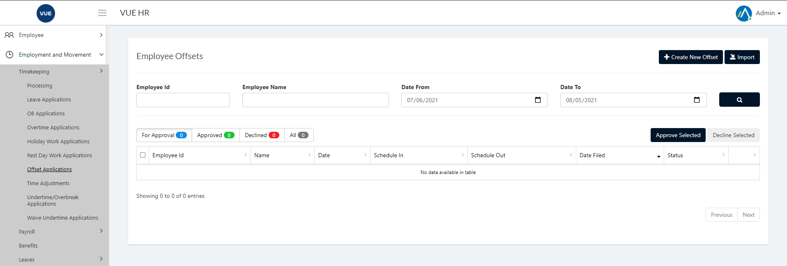
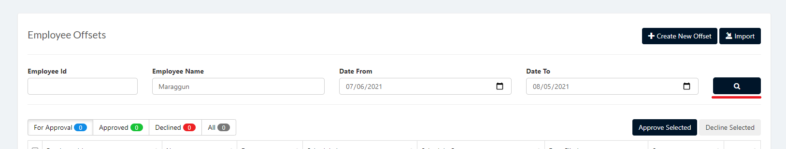
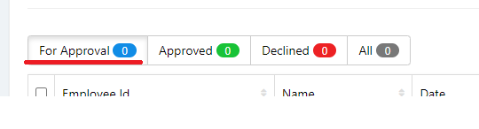
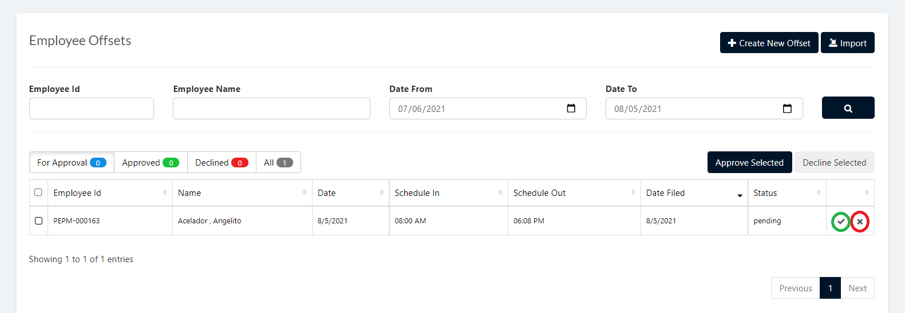
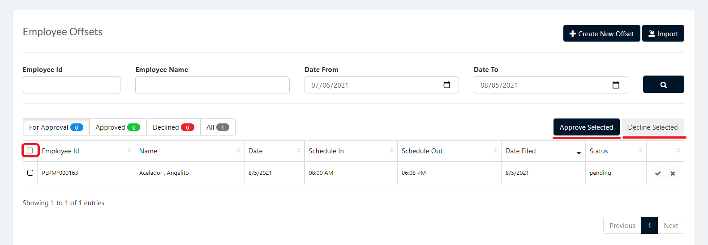

The Offset Application page is used to Create,Approve and Decline an employee's offset application.

## Display List of Employee Offset Application
1. Login to Vue using Admin or HR account. 

2. Go to Employment and Movement > Timekeeping > Offset Applications
 

3. Input correct filters and click the `Search` button.

## Approve/Decline Offset Application

1. Login to Vue using Admin or HR account. 

2. Go to Employment and Movement > Timekeeping > Offset Applications.
 

3. Input correct filters and click the `Search` button.

4. Click `For Approval` Tab to show all pending Offset applications.

5. Click `Check` or `X` button to approve or decline Offset application.

> **Note**: To approve or decline multiple application tick the `checkboxes` and Click `Approve Selected` or `Decline Selected`.

