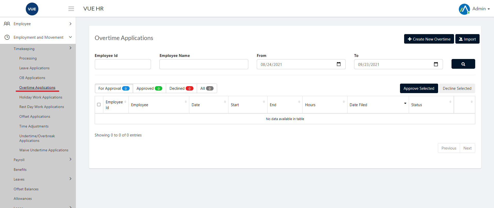
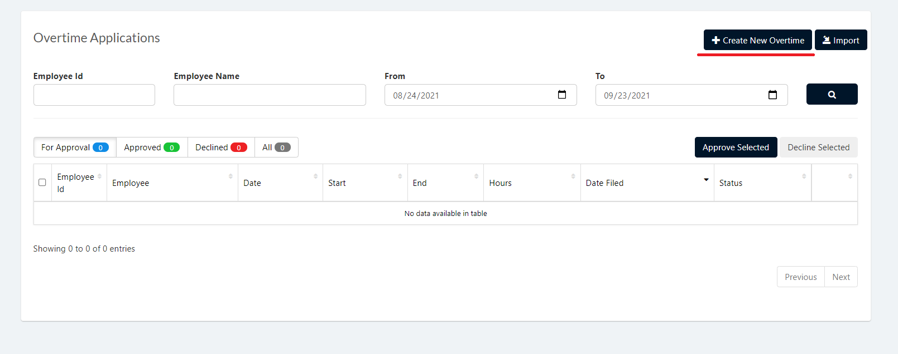
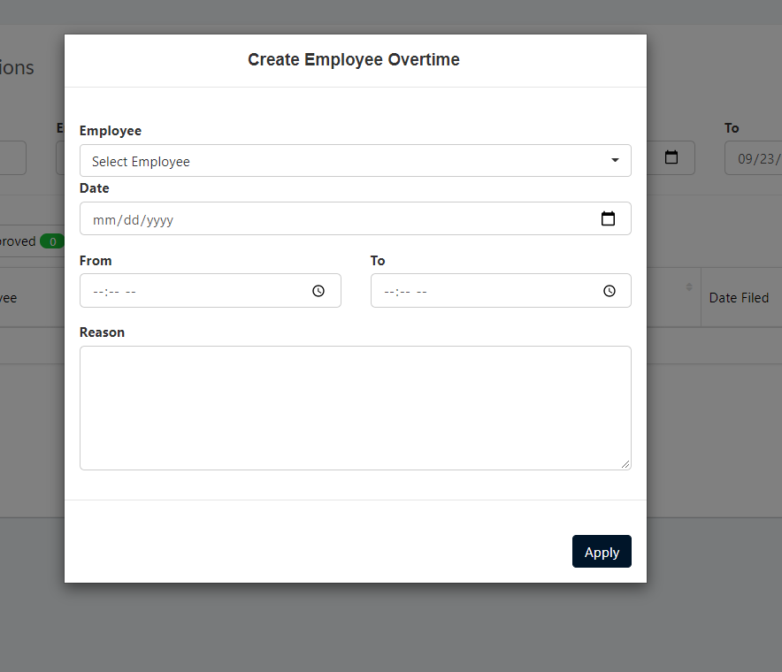
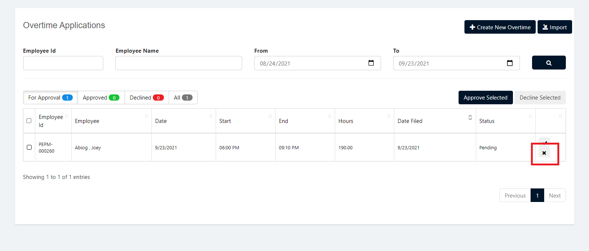

This page is for applying, approving and declining Overtime Applications.

## Create Overtime Applications 

1. Login to Vue using  Admin/HR account.
 
 

2. Go to Employment and Movement > Timekeeping > Processing > Overtime Application.

  

3. Click `Create New Overtime` button.

  

4. Select an employee, date, from and to what time, reason and then click `Apply` button.

> **Note** Click `Cancel` button to cancel create employee Overtime.

  

## Approving Overtime Applications 

1. Login to Vue using Admin or HR account. 

2. Go to Employment and Movement > Timekeeping > Processing > Overtime Application.

3. Set the Correct filter and click the search button

4. Click the `✓` button selected employee to approve.

> **Note** To approve multiple Overtime Applications check the employee and click `Approve Selected` button.

 

 ## Decline Overtime Applications 
 
 1. Login to Vue using Admin or HR account. 

2. Go to Employment and Movement > Timekeeping > Processing > Overtime Application.

3. Set the Correct filter and click the search button

4. Click the `X` button selected employee to approve.

> **Note** To decline multiple Overtime Applications check the employee and click `Decline Selected` button.
 
