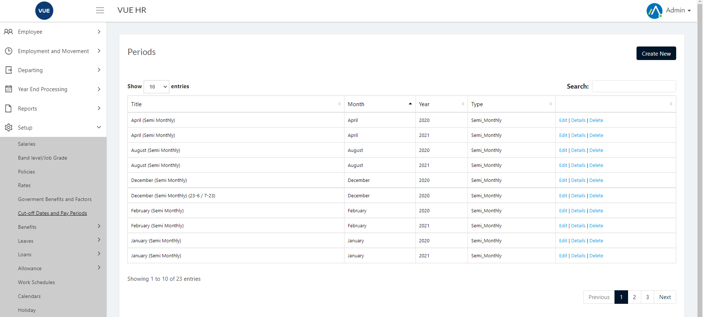
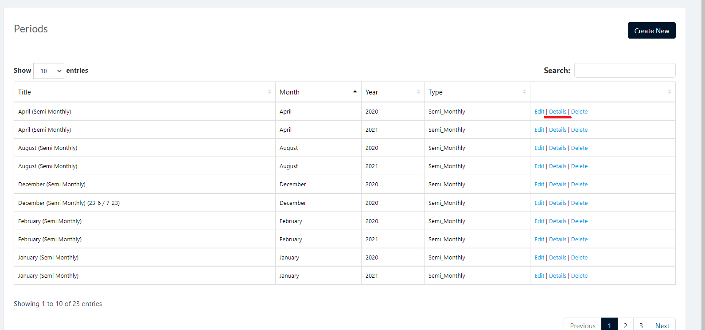
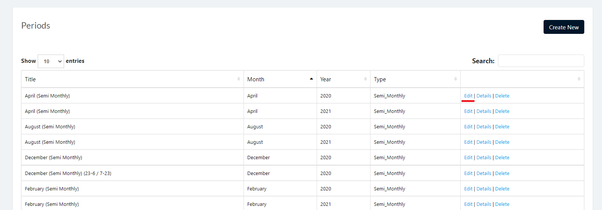
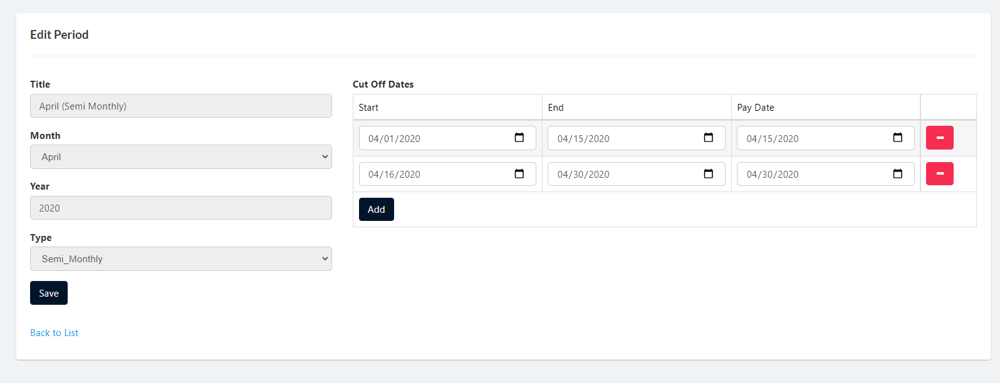
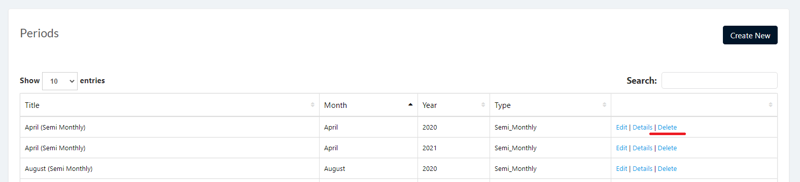
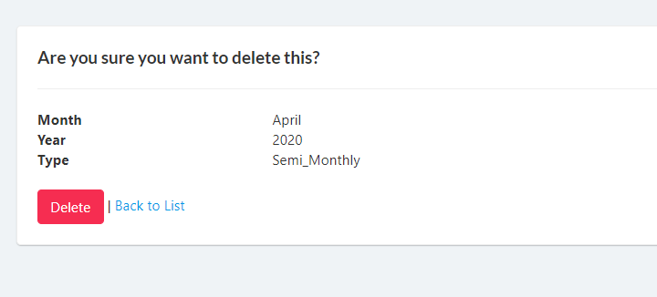

## Display List of Pay Periods
1. Login to Vue using Admin or HR account. 

2. Go to Setup > Cut-Off Dates and Pay Periods

3. Click `Details` to open details page.

## Create Pay Periods

1. Login to Vue using Admin or HR account. 

2. Go to Setup > Cut-Off Dates and Pay Periods

3. Click `Create New` button to open create page.

4. Input needed details and click `Create` button.

## Edit Pay Periods

1. Login to Vue using Admin or HR account. 

2. Go to Setup > Cut-Off Dates and Pay Periods

3. Click `Edit` to open edit page.

4. Input needed details and click `Save` button.

## Delete Pay Periods

1. Login to Vue using Admin or HR account. 

2. Go to Setup > Cut-Off Dates and Pay Periods

3. Click `Delete` link to open the delete confirmation page.

4. Click `delete` button to confrim delete.

