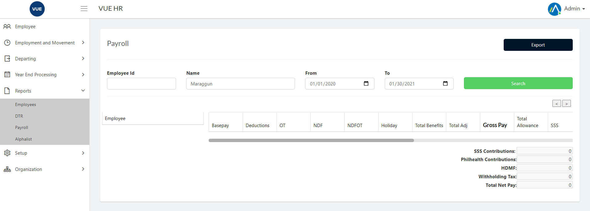
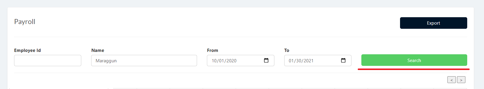
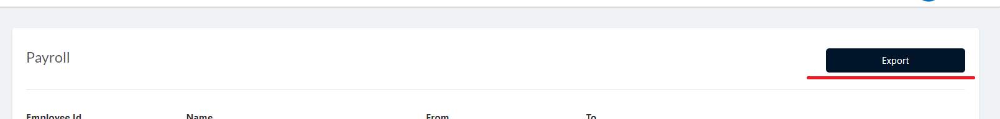

## Exporting Employee List
1. Login to Vue using Admin or HR account. 

2. Go to Reports > Payroll
 

3. Input correct filters and click the `Search` button.

4. Click `Export` button to export. The Exported file will be in .xlsx format.

5. Sample Export file.
