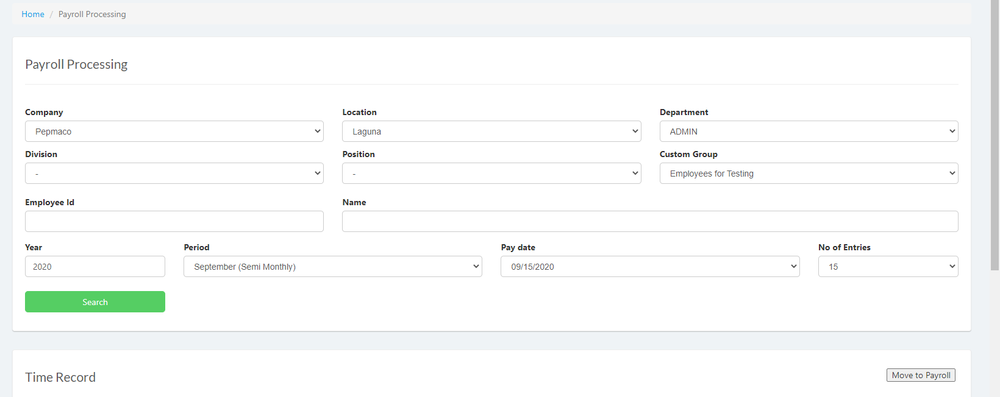
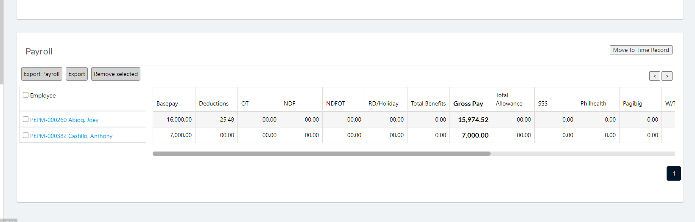
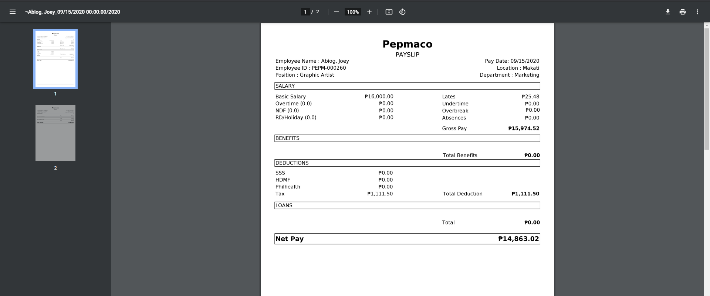

These are the steps to view a selected employee's Payslip.

1. Login to Vue as an Admin or HR. 
<!-- > **Note**: Click [here](/docs/users) to setup users. -->

2. Go to `Timekeeping and Payroll ` > `Payroll `.

3. Set the search filter then click search.

4. Click employee name in `Payroll` table.

5. A new tab will be opened and will display the Payslip

