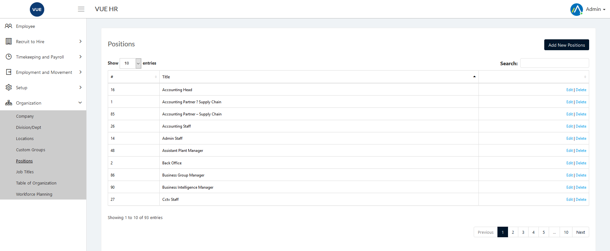
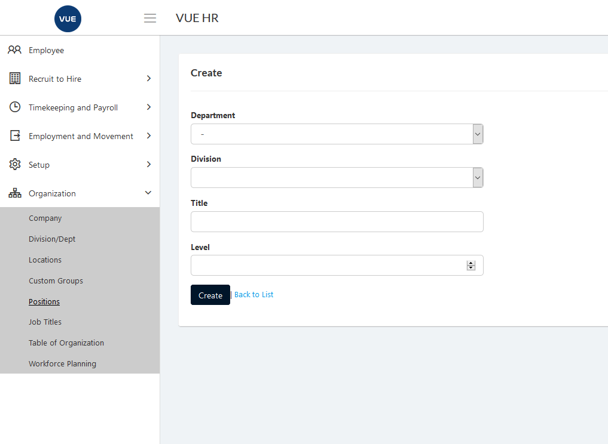
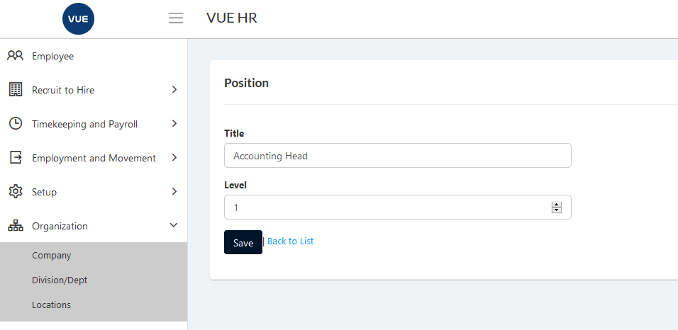
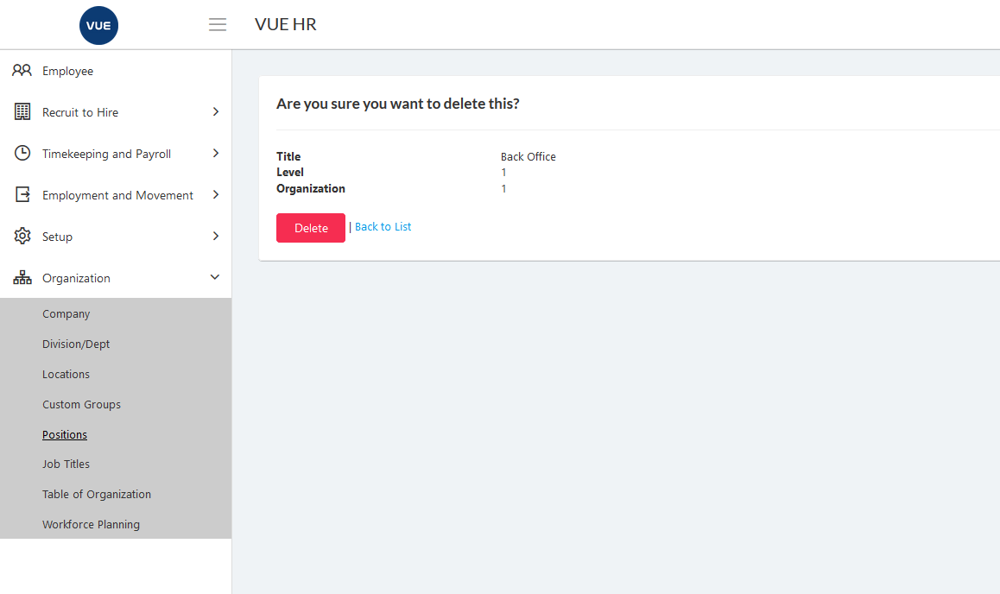

## Create New Position 

1. Login to Vue using Admin or HR account. 

2. Go to Organization > Positions.

3. Click `Add New Position` button.

  

4. Set the _Department_ _Division_, _Title_, _Level_.

5. Click `Create` button.
> **Note** Click `Back to list` button to cancel create Position.

  

## Edit/Update Position

1. Login to Vue using Admin or HR account. 

2. Go to Organization > Positions.

3. Click `Edit` button.

  

4. Set the _Department_ _Division_, _Title_, _Level_ and click `Save` buttton.
> **Note** Click `Back to list` button to cancel update Position.

  

## Delete Position

1. Login to Vue using Admin or HR account. 

2. Go to Organization > Positions.

3. Click `Delete` button.

 

4. Click `Delete` button to confirm delete.

> **Note** Click `Back to list` button to cancel delete Position.

 