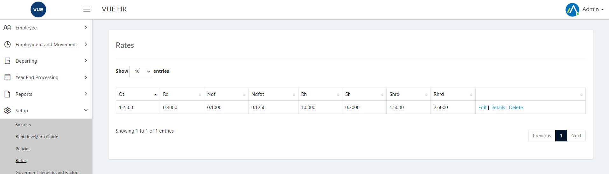
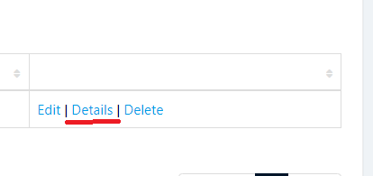
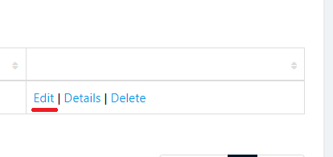
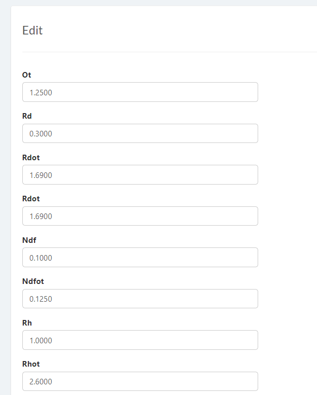
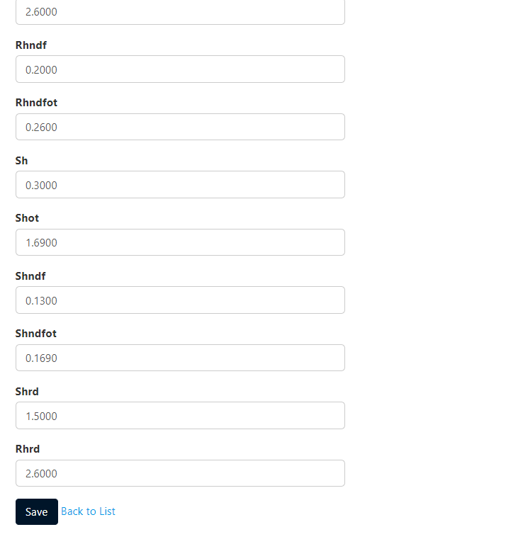
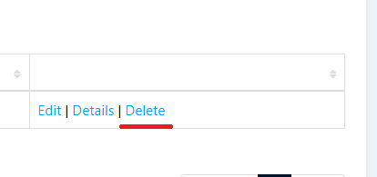

This page is for updating and deleting Rates.

## Display Rates

1. Login to Vue using Admin or HR account. 

2. Go to Employee > Setup > Rates

3. Click `Details` to open details page.

## Edit Rates

1. Login to Vue using Admin or HR account. 

2. Go to Employee > Setup > Rates

3. Click `Edit` to open details page.

4. Edit needed details and click `Save` button.

## Delete Rates

1. Login to Vue using Admin or HR account. 

2. Go to Employee > Setup > Rates

3. Click `Delete` to open delete confrimation page.

4. Click `Delete` to confirm delete. 