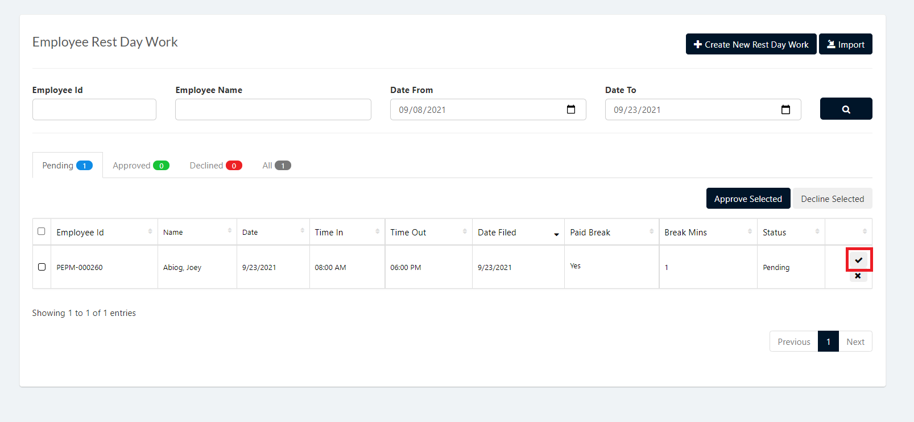
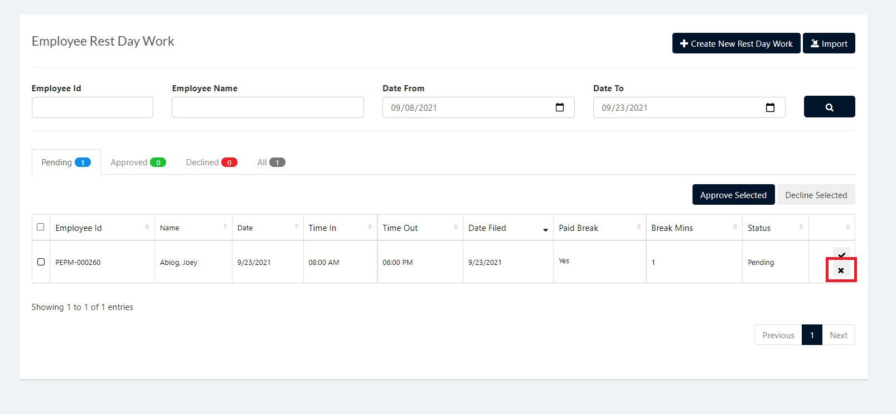

This page is for approving and declining Rest Day Work Request Application.

## Approving Rest Day Work Request Applications 

1. Login to Vue using Admin or HR account. 

2. Go to Employment and Movement > Timekeeping > Processing > Rest Day Work Application.

3. Set the Correct filter and click the search button

4. Click the `✓` button selected employee to approve.

> **Note** To approve multiple Rest Day Work Applications check the employee and click `Approve Selected` button.

 

 ## Decline Rest Day Work Request Applications 
 
 1. Login to Vue using Admin or HR account. 

2. Go to Employment and Movement > Timekeeping > Processing > Rest Day Work Application.

3. Set the Correct filter and click the search button

4. Click the `X` button selected employee to approve.

> **Note** To decline multiple Rest Day Work Applications check the employee and click `Decline Selected` button.

 
