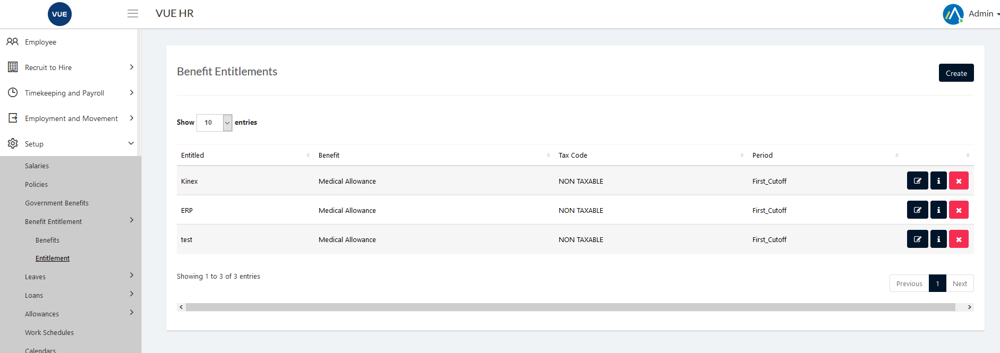

Rest Day Work Request Application is used to apply for Rest Day work requests

These are the following steps for creating and deleting the Rest Day Work Request.

## Create Rest Day Work Request Applications 

1. Login to Vue using  Admin/HR account.
 
 

2. Go to Timekeeping and Payroll > Processing > Rest Day Work Application.

  

3. Click `Create New Rest Day Work` button.

  

5. Select an employee, date, time in, time out, is paid break , break minutes and then click `Create` button.

> **Note** Click `Cancel` button to cancel create Rest Day Work Request.

  

## Approving Rest Day Work Request Applications 

1. Login to Vue using Admin or HR account. 

2. Go to Timekeeping and Payroll > Processing > Rest Day Work Application.

3. Set the Correct filter and click the search button

4. Click the `✓` button selected employee to approve.

> **Note** To approve multiple Rest Day Work Applications check the employee and click `Approve Selected` button.

 

 ## Decline Rest Day Work Request Applications 
 
 1. Login to Vue using Admin or HR account. 

2. Go to Timekeeping and Payroll > Processing > Rest Day Work Application.

3. Set the Correct filter and click the search button

4. Click the `X` button selected employee to approve.

> **Note** To decline multiple Rest Day Work Applications check the employee and click `Decline Selected` button.
 
