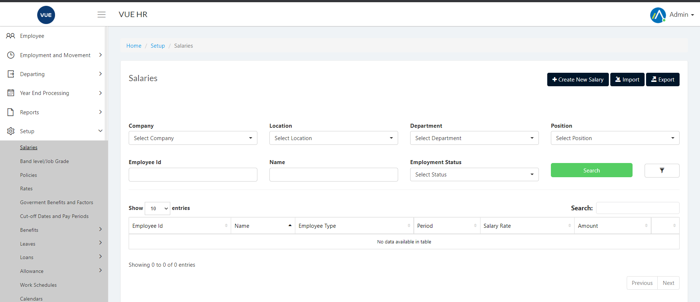
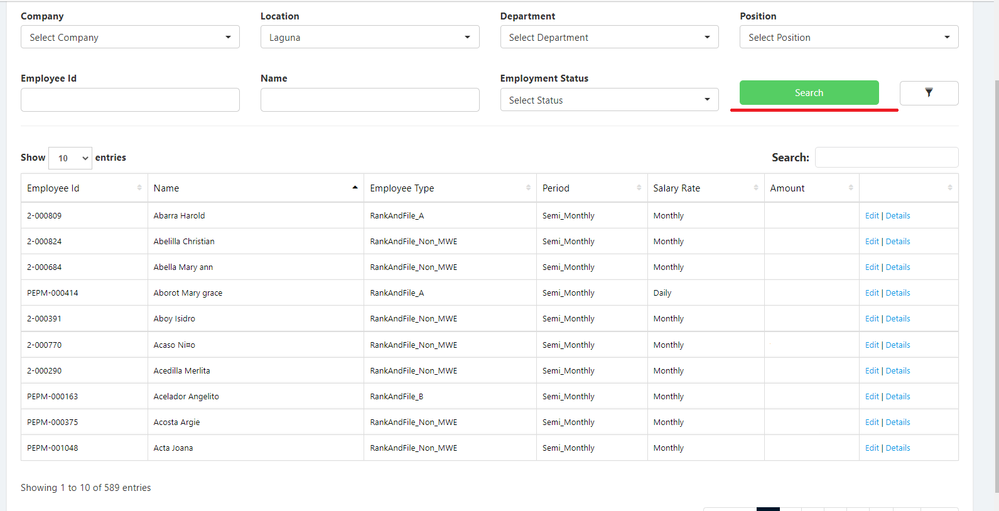
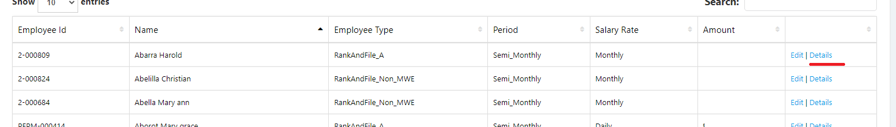
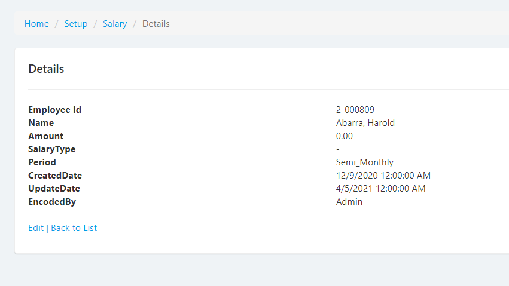
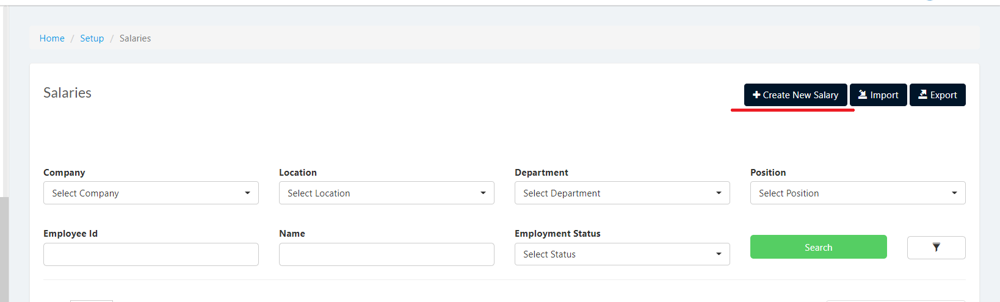
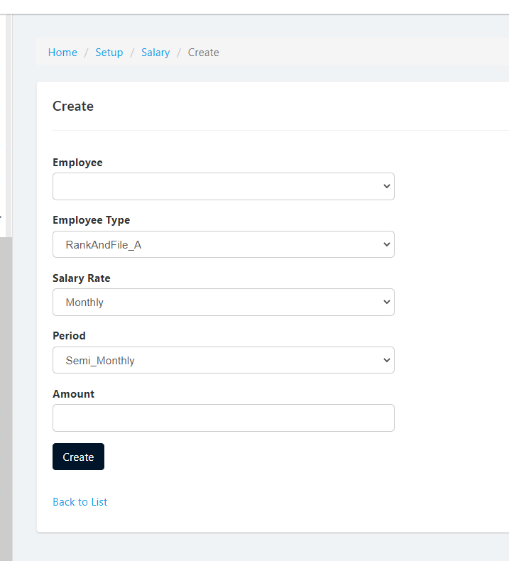
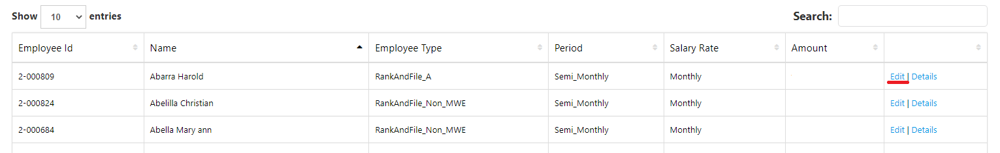
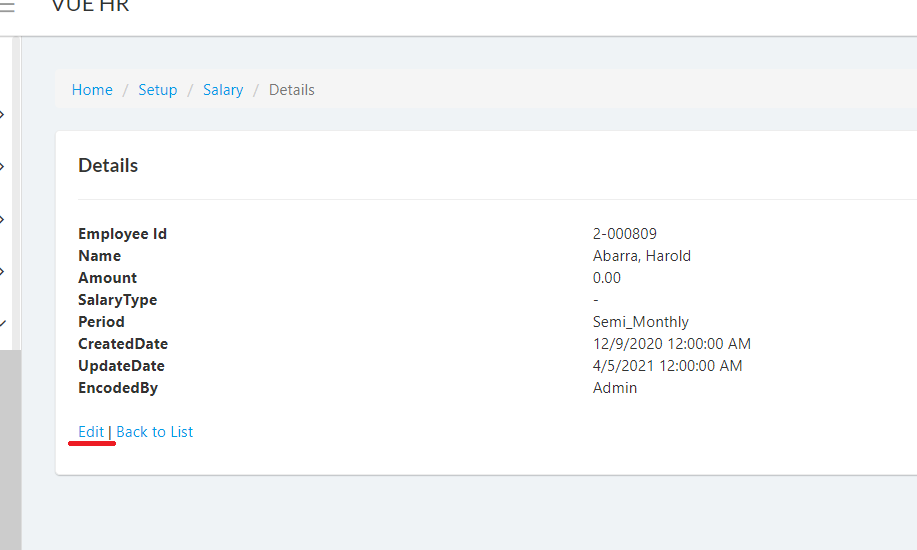
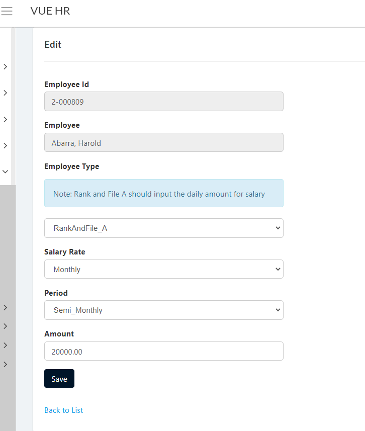

## Display Employee Salaries
1. Login to Vue using Admin or HR account. 

2. Go to Setup > Salaries
 

3. Input correct filters and click the `Search` button.

4. Click `Details` to open details of selected employee.

## Creating New Salaries
1. Login to Vue using Admin or HR account. 

2. Go to Setup > Salaries
 

3. Click `Create New Salary` button

4. The Create Salary page will open. The `Employee` dropdown will only list employees with no Salaries.

5. Select the `Employee Type`, `Salary Type`, `Period` and input the salary amount then click the `Create` button to crate salary for the employee.

## Editing Salaries
1. Login to Vue using Admin or HR account. 

2. Go to Setup > Salaries
 

3. Input correct filters and click the `Search` button.

4. Click `Edit` to open details of selected employee.

> **Note** There is also an `Edit` button inside the details page.

5. The Edit page will open. Click `Save` button after updating salaries details to save employee salaries.

