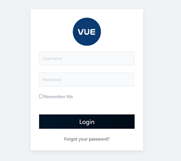
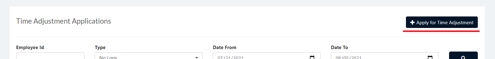

Time Adjustments page is used to create, approve and decline an application to adjust an emmployee's Time in/Time out.

## Display List of Employee Time Adjustment Application
1. Login to Vue using Admin or HR account. 

2. Go to Employment and Movement > Timekeeping > Time Adjustment

3. Input correct filters and click the `Search` button.

## Apply for Time Adjustment
1. Login to Vue using Admin or HR account. 

2. Go to Employment and Movement > Timekeeping > Time Adjustment

3. Input correct filters and click the `Search` button.

4. Click `Apply for Time Adjustment` to open the Create Time Adjustment Page.

5. Input needed details and click `Submit` button.

## Approve/Decline Time Adjustment

1. Login to Vue using Admin or HR account. 

2. Go to Employment and Movement > Timekeeping > Time Adjustment

3. Input correct filters and click the `Search` button.

4. Click `For Approval` Tab to show all pending Offset applications.

5. Click `Check` or `X` button to approve or decline Offset application.

