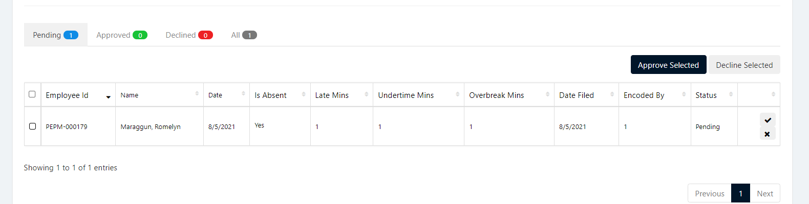
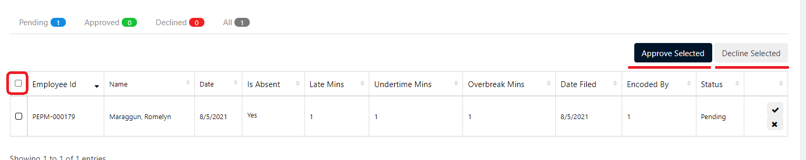

## Display List of Employee Undertime Application
1. Login to Vue using Admin or HR account. 

2. Go to Employment and Movement > Timekeeping > Undertime Application

3. Input correct filters and click the `Search` button.

## Apply for Time Adjustment
1. Login to Vue using Admin or HR account. 

2. Go to Employment and Movement > Timekeeping > Undertime Application

3. Input correct filters and click the `Search` button.

4. Click `Create New Undertime` to open the Add Employee Undertime Page.

5. Input needed details and click `Submit` button.

## Approve/Decline Time Adjustment

1. Login to Vue using Admin or HR account. 

2. Go to Employment and Movement > Timekeeping > Time Adjustment

3. Input correct filters and click the `Search` button.

4. Click `For Approval` Tab to show all pending Offset applications.

5. Click `Check` or `X` button to approve or decline Offset application.

> **Note**: To approve or decline multiple application tick the `checkboxes` and Click `Approve Selected` or `Decline Selected`.

