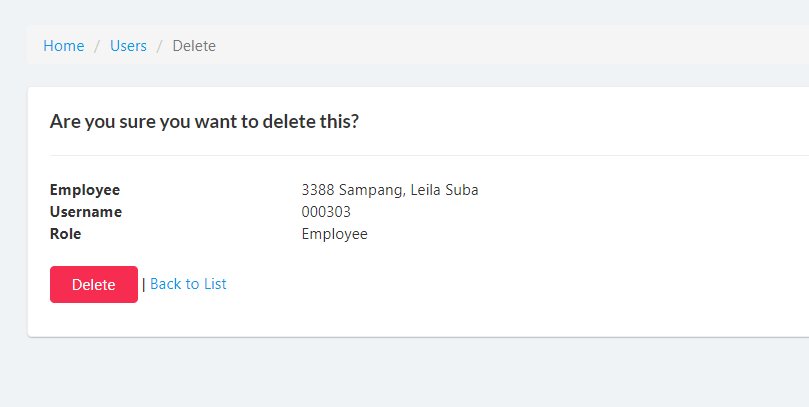

## Display List of Users
1. Login to Vue using Admin or HR account. 

2. Go to Setup > Users

## Create Users

1. Login to Vue using Admin or HR account. 

2. Go to Setup > Users

3. Click `Create` button to open create page.

4. Input needed details and click `Create` button.

## Delete Users

1. Login to Vue using Admin or HR account. 

2. Go to Setup > Cut-Off Dates and Pay Periods

3. Click `Delete` link to open the delete confirmation page.

4. Click `delete` button to confrim delete.

