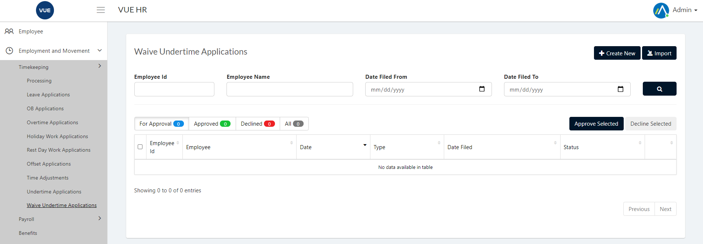
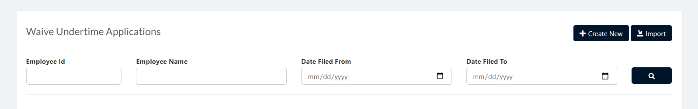
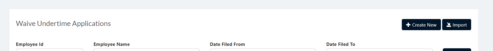
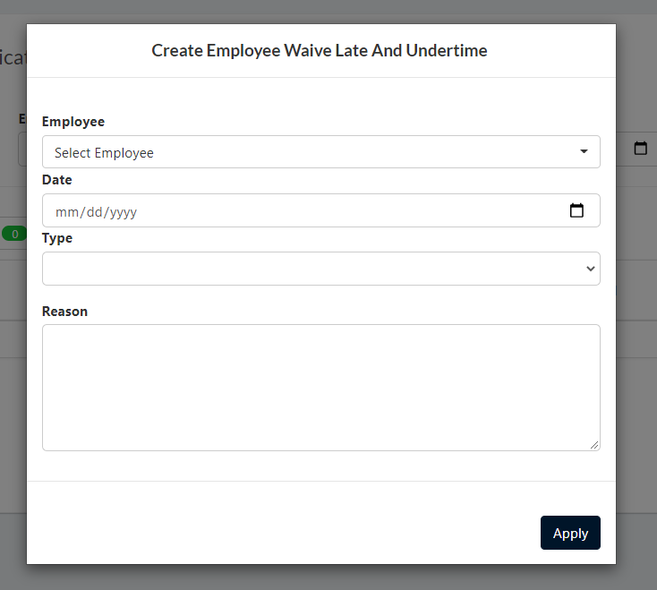
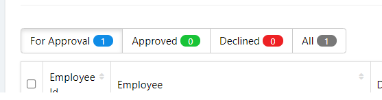
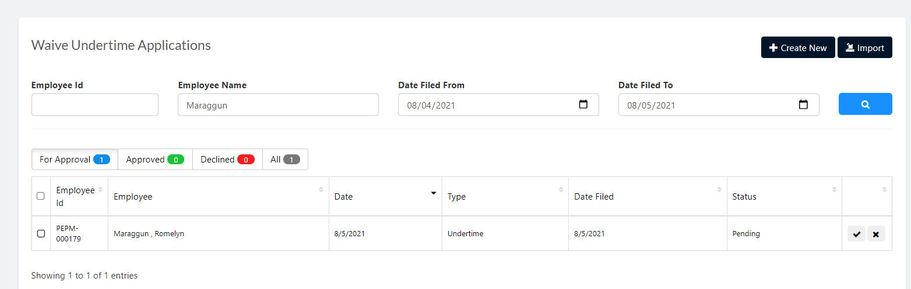
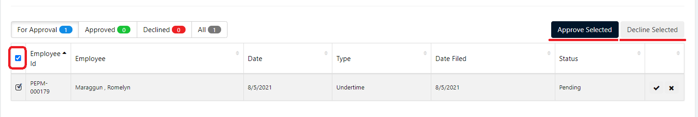

Waive Undertime page is used to create, approve and decline waive undertime application of an employee.

These are the following steps for create, approve and decline the Waive Undertime Applications.

## Display List of Employee Waive Undertime Application
1. Login to Vue using Admin or HR account. 

2. Go to Employment and Movement > Timekeeping > Waive Undertime Application

3. Input correct filters and click the `Search` button.

## Apply for Waive Undertime Application
1. Login to Vue using Admin or HR account. 

2. Go to Employment and Movement > Timekeeping > Waive Undertime Application

3. Input correct filters and click the `Search` button.

4. Click `Create New Waive Undertime` to open the Add Waive Undertime Page.

5. Input needed details and click `Apply` button.

## Approve/Decline Waive Undertime Application

1. Login to Vue using Admin or HR account. 

2. Go to Employment and Movement > Timekeeping > Time Adjustment

3. Input correct filters and click the `Search` button.

4. Click `For Approval` Tab to show all pending Offset applications.

5. Click `Check` or `X` button to approve or decline Offset application.

> **Note**: To approve or decline multiple application tick the `checkboxes` and Click `Approve Selected` or `Decline Selected`.

